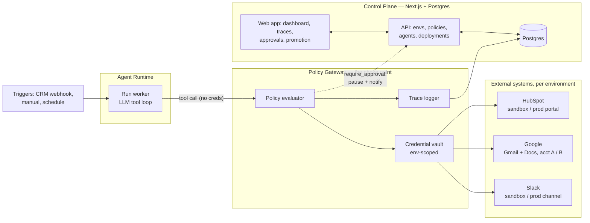

# Convoy — Product Spec & Investor Demo Plan

**Company:** Convoy
**Thesis in one line:** Employees spawn personal agents; companies need **company agents**. Convoy is where a company creates, permissions, tests, and runs its fleet of routine-work agents — LLMs that reason and make decisions, execute only the actions their environment allows, and flag consequential decisions for human approval.
**POC scope:** user-set-up environments (Sandbox + Production) · tools attached to environments with permissions · create-or-select agents · run in Sandbox to test, in Production to work.
**Demo target:** Fully working end-to-end, ~6 minutes, investor audience.

---

## 1. Positioning

### Personal agents vs. company agents

Every company is already full of **personal agents**: employees spinning up ChatGPT, Claude, and Copilot sessions tied to their own identity, their own credentials, their own chat history. Personal agents are fine for assisting an individual — and structurally wrong for doing the company's work. They walk out the door with the employee, run on whatever access that person happens to have, leave no institutional audit trail, and multiply into the shadow-AI sprawl security teams are currently fighting. The company's work deserves **company agents**: durable digital workers that belong to the organization — created once, governed centrally, permissioned by environment rather than by person, tested before they touch production, and supervised through approvals. Convoy is where company agents are hired, badged, and put to work.

### The automation gap

Company work sits on a spectrum. One end is fully scriptable — code, RPA, and Zapier already own it. The other end requires human connection and taste — marketing creative, outbound sales messaging, anything where voice and relationships are the product. Convoy deliberately targets neither end. We target the band in between: **routine busy work that can't be fully automated through code** — routine in shape, fuzzy in content. Reading a closed deal and producing its paperwork. Researching a lead. Reconciling records across systems. Keeping docs current. Too variable for if-statements, too routine to deserve human attention. LLMs just made this band automatable for the first time, and Convoy's agent model is built for exactly it: **the LLM reasons and makes the small decisions, the environment defines the only actions it can execute, and consequential or uncertain decisions get flagged for human approval.** This scoping is a feature, not a limitation:

1. **Routine work is high-volume** → it naturally requires a *fleet* of agents, not a copilot. Fleet economics, not seat economics.
2. **Routine work is verifiable** → outputs can be checked deterministically, which means agents can actually be *tested* before promotion.
3. **Routine work touches systems of record** → CRM, billing, email, docs. One bad write multiplied by a fleet is a disaster, so environments, permissions, approvals, and audit are not nice-to-haves — they are the product.

The judgment layer stays human. We sell the infrastructure that makes the routine layer safe to hand over.

### Why now

- **MCP standardized the connector surface.** Tool integration is no longer bespoke; the ecosystem converged on a protocol we can govern at a single choke point.
- **Models crossed the reliability threshold for bounded tasks.** Routine, well-scoped work with verifiable outputs is squarely inside current capability.
- **Enterprises are blocked on safety, not capability.** Every buyer conversation about agents ends at "who approved that action and can we prove it?" We answer that question by construction.

### What Convoy is (and is not)

Convoy is the **SDLC for company agents**: isolated environments, per-environment tools and credentials, a permission policy enforced on every action, a test harness, a promotion gate, and a production runtime with human-in-the-loop approvals and a complete audit trail.

Convoy is not an agent framework (LangGraph et al. are libraries for building one agent; Convoy is the layer where agents get deployed, governed, and supervised as company assets). Not an RPA/workflow tool (those orchestrate deterministic, human-designed flows and break the moment inputs vary; Convoy's unit is an agent that reasons). Not a personal copilot (copilots assist a human doing the work; Convoy agents *are* the worker, with humans at the approval gates).

---

## 2. Core object model

Everything in the product and the architecture derives from six objects:

| Object | Definition |
|---|---|
| **Environment** | An isolated context (Sandbox, Production) with its own connector instances, credentials, and permission policies. |
| **Connector** | An integration (CRM, email, docs, chat) *instantiated per environment* with environment-specific credentials — sandbox CRM in Sandbox, real CRM in Production. |
| **Permission policy** | Rules attached at the (connector, environment) level: allow / deny / require-approval per tool, with conditions (e.g., recipient domain), approvers, and timeouts. |
| **Agent** | A versioned unit of work logic — created in Convoy's lightweight builder, from scratch or from a catalog template (both in POC scope). An agent carries its instructions and declares which tools it needs from its environment. |
| **Deployment** | A binding of an agent version to an environment. Promotion = creating a Production deployment from a Sandbox-validated version. |
| **Run / Trace** | One execution of a deployed agent. Every tool call is logged (inputs, outputs, policy decision, latency) and replayable. |

Terminology: a **connector** is an integration (HubSpot, Google, Slack); each exposes **tools** — individual actions like `crm.update_deal` or `email.send`; **permissions** are set per tool, per environment. "Attaching tools to an environment" means attaching a connector instance with environment-scoped credentials and setting its per-tool policy.

The invariant that makes the whole system trustworthy: **agents never hold credentials.** Every tool call passes through a policy-enforcing gateway that injects environment-scoped credentials and applies the policy. The same agent behaves differently in Sandbox vs. Production because the *environment*, not the agent, defines what is allowed.

---

## 3. Demo narrative: Meridian's convoy

The demo company is **Meridian Labs**, a fictional ~200-person B2B SaaS. Their RevOps team runs a convoy of four company agents — all routine, none customer-facing-creative:

| Agent | Trigger | Reads | Writes | Gated action (Prod) |
|---|---|---|---|---|
| **Lead Research Agent** | New lead created in CRM | Web, CRM | CRM enrichment fields, research brief doc | Marking a lead "research-qualified" |
| **Closed-Won Paperwork Agent** ⭐ | Deal moves to Closed-Won | CRM deal record, pricing doc | Order form doc, CRM fields, kickoff checklist, Slack notify, **invoice email to customer** | Sending external email |
| **Docs Sync Agent** | Product change flagged | Change log, existing docs | Draft doc updates | Publishing a doc |
| **CRM Hygiene Agent** | Nightly schedule | CRM | Dedupe/normalize fields, stale-record flags | Merging duplicate records |

⭐ **Deep-dive agent for the demo: Closed-Won Paperwork.** Rationale: it has the most visceral approval-gate moment (an agent about to email a real customer an invoice — everyone in the room feels why that needs a gate), the richest connector story (CRM + docs + email + chat in one run), a naturally fleet-shaped trigger (every closed deal spawns a run), and it maps word-for-word to "the paperwork for closing a sale."

The other three agents exist in the demo as **live dashboard tiles** — they establish the fleet story in the cold open ("overnight: 47 leads researched, 6 deals papered, 12 doc drafts, 31 records cleaned — zero humans") without needing their own deep-dives.

### Use-case selection rubric (also an investor slide)

An agent belongs on Convoy if it scores yes on all five:

1. **Routine** — the task recurs with the same shape; no novel judgment per instance.
2. **Taste-free** — output quality is correctness, not voice, relationship, or creativity.
3. **Verifiable** — success can be checked against system state (field set, doc exists, email drafted correctly).
4. **Systems-of-record** — the work is reads/writes against CRM, billing, docs, email, ticketing.
5. **Volume-bearing** — enough instances per month that a fleet beats a hire.

Explicit exclusions (say these out loud to investors — it builds trust): marketing content creation, outbound sales messaging, customer support conversations requiring empathy, anything brand-voice-sensitive.

### Expansion library (roadmap slide, not demo scope)

AP invoice intake and 3-way match · vendor onboarding packets · renewal paperwork assembly · compliance evidence collection · meeting-notes-to-CRM logging · ticket triage and routing (routing only, no replies) · recurring report assembly · data-entry reconciliation between systems · offboarding checklists · contract metadata extraction into the CLM.

---

## 4. Critical User Journeys

Two personas for v1: **Admin** (owns environments, connectors, policies) and **Operator** (selects, tests, promotes, and supervises agents). In small teams these are the same person; the demo can play both.

### CUJ-1 · Admin sets up an environment

**Trigger:** New workspace, or a new system needs governing.
**Journey:** Create "Sandbox" → attach connectors (CRM sandbox portal, test email account, docs workspace, chat channel) via per-environment OAuth → set policy: everything auto-allowed, but email sends restricted to the sandbox domain. Repeat for "Production" with real credentials and a strict policy: external email send → **require approval**; CRM writes → allowed but logged; doc publish → require approval.
**Success:** Both environments show green connector health checks; policies visible as a readable rule list.
**Demo beat:** Pre-built before the demo; shown for ~20 seconds as the "here's what makes this safe" reveal.

### CUJ-2 · Operator creates (or selects) an agent

**Trigger:** Team wants closed-won paperwork automated.
**Journey:** Open the catalog of company-agent templates → start from the Closed-Won Paperwork template, or "create from scratch" → the lightweight builder: name, **instructions** (the agent's operating prompt), **tool grants** (picked from what the target environment offers: crm.read_deal, docs.create, email.send, chat.post), **parameters** (order form template, invoice terms, notification channel), and **trigger** (deal-stage webhook) → save as v1 → bind to Sandbox.
**Success:** The agent exists as a versioned company asset, not tied to any employee's login; binding validates every granted tool is available and permitted in Sandbox (or surfaces the gap).
**Demo beat:** Live, ~60 seconds — "hiring a company agent."

### CUJ-3 · Operator tests the agent in Sandbox

**Trigger:** Deployment exists; needs validation before anyone trusts it.
**Journey:** Fire a manual test trigger (mark a sandbox deal Closed-Won) → watch the **live trace**: every tool call streaming in with inputs, outputs, and policy verdicts → inspect artifacts (generated order form, updated CRM fields, drafted invoice email — sent, because Sandbox policy allows sandbox-domain sends) → run the **scenario suite**: 8 fixtures covering edge cases (missing PO number, non-USD currency, duplicate deal, discount over threshold) → get a pass/fail matrix.
**Success:** 8/8 green; every assertion checked against actual sandbox system state, not agent self-report.
**Demo beat:** Live, the longest beat (~2 min). This is where Convoy stops being slideware.

### CUJ-4 · Operator promotes to Production

**Trigger:** Tests green; team ready to go live.
**Journey:** Click Promote → **pre-flight diff**: credentials swap (sandbox portal → real portal, test inbox → real inbox), policy delta ("email.send: auto-allow → requires approval by RevOps lead"), test status (8/8 on this exact version) → sign off → Production deployment created.
**Success:** Promotion recorded in the audit log with who, what version, what diff, when.
**Demo beat:** Live, ~30 seconds. The diff modal is the "agents get the SDLC" money shot.

### CUJ-5 · Agent runs in Production with an approval gate

**Trigger:** A real deal moves to Closed-Won.
**Journey:** Run starts automatically → agent reads the deal, generates the order form, updates CRM, posts to Slack — all auto-allowed and logged → agent calls email.send to the customer → **run pauses**; approval card appears in the queue and in Slack, showing the exact email, recipient, attachment, and the trace context that produced it → Operator approves → email sends → run completes.
**Success:** The gated action executed only after human approval; total human effort was one review, not doing the work.
**Demo beat:** Live, ~1.5 min. The pause is the emotional peak of the demo.

### CUJ-6 · Admin audits and controls the fleet

**Trigger:** "Who let the agent send this?" / something looks off.
**Journey:** Fleet dashboard → filter audit log to the sent email → open its full causal trace (trigger → every read → every write → policy verdicts → approver identity and timestamp) → demonstrate the kill switch: pause an agent fleet-wide in one click.
**Success:** Any production action is explainable end-to-end in under 30 seconds.
**Demo beat:** Live, ~40 seconds; closes the loop on the safety story.

---

## 5. Product requirements (demo scope)

### Goals

1. An investor watching the demo believes: **agents doing real work against real systems is safe when governed by Convoy** — demonstrated, not claimed.
2. Creating (or selecting) a company agent and taking it from Sandbox-tested to Production takes **under 15 minutes** of human effort, including testing and promotion.
3. **100% of production tool calls** are policy-checked, logged, and attributable; gated actions execute only after recorded human approval.
4. The fleet framing lands: one dashboard, four agent types, dozens of runs — volume is visible.

### Non-goals (v1 / demo)

- **Advanced agent builder** — the POC ships a lightweight form-based builder (instructions, tool grants, parameters, trigger); visual workflow designers and multi-agent orchestration are roadmap. (Complexity sink; the governance story doesn't need them.)
- **Creative or outbound-messaging agents** — outside the thesis by design.
- **RBAC / SSO / multi-tenant hardening** — single workspace, two personas; enterprise auth is post-demo.
- **Model routing / multi-model support** — one model, hardcoded; architecture keeps the seam.
- **Billing/metering** — talk track only.

### P0 — the demo cannot ship without these

**Environments**

- [ ] Create/view environments; each holds its own connector instances and encrypted credentials.
- [ ] Environment health check: every attached connector verifiably reachable with its scoped credentials.

**Connectors & secrets**

- [ ] Four working connectors: CRM (HubSpot), Email + Docs (Google), Chat (Slack).
- [ ] Per-environment OAuth/credential storage; credentials never leave the gateway boundary.

**Policy engine**

- [ ] Per-(connector, tool, environment) rules: `allow` / `deny` / `require_approval`, with at least one condition type (recipient-domain allowlist) and named approver.
- [ ] Policy evaluated on **every** tool call; verdict recorded on the trace.

**Agent creation, catalog & deployment**

- [ ] Lightweight builder: create an agent from scratch or from a template — name, instructions, tool grants, parameters, trigger — saved as a version; agents are workspace assets, not user-owned.
- [ ] Four prebuilt templates (the Meridian convoy) with declared tool requirements and configurable parameters.
- [ ] Bind agent version → environment; binding validates every granted tool exists and is permitted under that environment's policy.

**Runtime & traces**

- [ ] Trigger a run manually and via CRM webhook (deal-stage change).
- [ ] Live-streaming trace view: each tool call with inputs, outputs, policy verdict, timing.
- [ ] Given a gated tool call, when policy says `require_approval`, then the run pauses, an approval item is created, and Slack is notified; on approve the call executes and the run resumes; on reject the run terminates cleanly with the rejection on the trace.
- [ ] Built-in `flag_for_review(reason, proposed_action)` tool available to every agent; calling it pauses the run and creates an approval item identical to a policy gate, tagged **agent-flagged** — the model's own escalation path when it judges a decision consequential or ambiguous.

**Testing**

- [ ] Scenario suite per agent: fixture seed → trigger → **assertions checked against actual sandbox system state** (CRM field values, doc existence/content, email presence) — never against agent self-report.
- [ ] Pass/fail matrix tied to the specific agent version; 8 scenarios for the deep-dive agent.

**Promotion**

- [ ] Pre-flight diff: credential source change, policy delta, test status for this exact version.
- [ ] Promotion blocked unless the suite is green on the candidate version; sign-off recorded.

**Observability & audit**

- [ ] Fleet dashboard: per-agent run counts, success rate, actions auto vs. gated, approval latency.
- [ ] Append-only audit log; any production write traceable to its full causal chain in ≤ 2 clicks.
- [ ] Fleet-wide pause (kill switch) per agent.

### P1 — fast follows (roadmap slide)

Visual agent builder / multi-step designer · budgets and rate limits per policy · scheduled + event trigger framework · version rollback · PII redaction in traces · eval regression runs on model updates · RBAC/SSO/audit export · connector marketplace (bring-your-own MCP server).

### P2 — architectural insurance

Multi-model routing per agent · policy-as-code (versioned, reviewable) · cross-environment data anonymization pipes (prod-shaped fixtures for sandbox) · agent-to-agent handoffs within a fleet.

### Success metrics

*Demo-day (leading):* zero live failures across 2 rehearsed runs + 1 cold run; every investor question about "what if it does something bad" answerable by pointing at a screen already shown.
*Product north star (lagging):* time-to-safe-deploy (target: < 1 day from catalog to prod, vs. months for bespoke builds) · autonomous-action rate (% of tool calls not requiring approval, rising over time as trust accrues) · approval latency (median < 15 min) · production incidents attributable to ungoverned actions: **zero by construction**.

---

## 6. Technical design

### 6.1 Architecture overview



Three services and a database. The **agent runtime never touches credentials or external systems directly** — it emits abstract tool calls; the gateway does everything else. That separation is the product.

### 6.2 The Policy Gateway (crown jewel)

Lifecycle of one tool call:

1. Worker sends `{run_id, tool: "email.send", args}` to the gateway (internal HTTP/gRPC).
2. Gateway resolves the run → deployment → environment.
3. Loads the policy for (connector=email, tool=send, environment=prod); evaluates conditions against args (e.g., recipient domain not in allowlist).
4. **allow** → fetch env-scoped credentials from the vault, execute against the real API, log request/response/latency, return result to the worker.
5. **require_approval** → persist the pending call, set run state `paused_pending_approval`, create approval item, notify Slack + queue. Worker blocks on the call (long-poll with heartbeat).
6. On **approve** → execute as in (4), attach approver identity + timestamp to the trace, resume. On **reject/timeout** → return a structured rejection; the agent loop terminates the run gracefully and reports why.
7. **deny** → structured refusal returned immediately; logged.
8. Every branch writes an immutable trace row *before* returning.

Approvals reach humans by two paths. **Policy-gated:** the environment forces review of specific tools regardless of what the model thinks — deterministic guardrails you can prove. **Agent-flagged:** the model escalates itself via the built-in `flag_for_review` tool when a case looks consequential or out-of-distribution — judgment you can supervise. Both produce the same approval item, same queue, same trace context; reviewers see one inbox.

Policy rule shape (stored as JSON, editable in UI):

```json
{
  "connector": "google_email",
  "tool": "send_email",
  "environment": "production",
  "effect": "require_approval",
  "conditions": { "recipient_domain_not_in": ["meridianlabs.dev"] },
  "approvers": ["revops_lead"],
  "timeout_hours": 4,
  "on_timeout": "reject"
}
```

Design choice worth stating to technical investors: connectors are wrapped as **MCP servers mounted behind the gateway**, so any MCP-compatible integration inherits governance for free. The gateway is protocol-level, not integration-level — that's how the connector marketplace (P1) works without per-connector policy code.

### 6.3 Data model (core tables)

`workspaces` · `environments(workspace_id, name, kind)` · `connectors(type, tool_manifest)` · `connector_instances(environment_id, connector_id, credentials_encrypted, health_status)` · `policies(environment_id, connector_id, tool, effect, conditions_json, approvers, timeout)` · `agents(name, description, tool_requirements, param_schema)` · `agent_versions(agent_id, version, prompt_bundle, config)` · `deployments(agent_version_id, environment_id, params_json, status)` · `runs(deployment_id, trigger_type, state, started_at, ended_at)` · `tool_calls(run_id, seq, tool, args_json, result_json, policy_effect, latency_ms)` · `approvals(tool_call_id, status, approver, decided_at)` · `test_scenarios(agent_id, fixture_json, trigger_json, assertions_json)` · `test_runs(agent_version_id, scenario_id, status, detail_json)` · `promotions(deployment_id, from_env, to_env, diff_json, approved_by)` · `audit_events(append-only)`.

Run state machine: `queued → running → paused_pending_approval → running → succeeded | failed | rejected | killed`.

### 6.4 Agent runtime

One worker process per run (Node/TS to share types with the gateway; containerize later, plain child processes are fine for the demo). The loop: build context from trigger payload + agent config → call the model with the tool schemas the gateway exposes for this deployment → forward tool_use blocks to the gateway → feed results back → repeat until the agent emits a completion report. The loop is Convoy's agent model made literal — **reason, act, flag**: the model reasons over its instructions and context, acts only through gateway-exposed tools, and flags via `flag_for_review` whenever its own judgment says a human should look. Message history is persisted per run after each turn, so a paused run survives a worker restart (reconstruct-and-continue) — cheap durability that also gives you replay for free.

### 6.5 Environments in the demo, concretely

| | Sandbox | "Production" |
|---|---|---|
| CRM | HubSpot developer test portal #1 (free) | HubSpot developer test portal #2 |
| Email + Docs | Google account A (test-user OAuth) | Google account B |
| Slack | `#revops-sandbox` | `#revops` |
| Policy | Auto-allow; email restricted to sandbox domain | External email + doc publish → approval; writes logged |

One Google Cloud project in *testing* mode with both accounts as test users covers Gmail + Docs + Drive scopes and skips OAuth verification review entirely — the biggest external long pole, dodged. HubSpot over Salesforce for the same reason: free developer portals, sane API, no sandbox licensing. Two real HubSpot portals playing sandbox/prod makes "fully working" true without an enterprise contract.

### 6.6 Test harness

Scenario = `{fixture, trigger, assertions[]}`. Fixture seeding is idempotent (each run creates namespaced records, torn down after). Assertions are **reads through the same gateway** against sandbox state: `crm.deal.field == expected`, `docs.exists(title~=...) && contains(...)`, `email.draft_or_sent(to=..., contains=...)`. Deterministic checks first; one optional LLM-judge assertion on invoice-email correctness (numbers match the deal) as a P1 flourish. The suite binds to an `agent_version`, which is what makes the promotion gate honest.

### 6.7 Stack

Next.js + TypeScript + Tailwind (control plane and UI) · Postgres via Supabase (also gives you row-level encrypted secrets storage quickly) · Node/TS gateway and workers, shared type package · Claude API for the agent loop · SSE for live trace streaming · Slack Bolt for approval notifications with action buttons. (If you'd rather Angular for the UI you'll be faster in it — nothing below the UI changes — but the SSR/streaming defaults in Next make the live-trace view cheaper.)

### 6.8 Build sequence

- **M0 — the spine.** Gateway + HubSpot connector + hardcoded policy + trace rows in Postgres. A script triggers a trivial agent that reads a deal and writes a field. *Proves the choke-point architecture in days.*
- **M1 — see it.** Live trace UI over SSE, runs list, manual trigger button.
- **M2 — the gate.** Policy engine + approval pause/resume + Slack notify. *This is the emotional core; get it rock-solid early.*
- **M3 — the fleet.** Google + Slack connectors, all four agents implemented, webhook trigger, dashboard tiles.
- **M4 — the discipline.** Test harness + scenario suite + promotion diff/gate.
- **M5 — the show.** Second environment wired as "prod," seed scripts, demo-mode flag (pinned temperature, curated fixtures), polish, rehearse.

Long poles to start first: HubSpot portal setup + webhook config, Google OAuth test-mode app, and the pause/resume state machine (M2). Demo-day risk mitigations: one-command reseed script, a recorded backup video, and rehearse the *reject* path too — investors ask "what if you say no?"

---

## 7. Demo script (~6 minutes)

**Beat 1 — Cold open (30s).** Convoy dashboard, already live. "This is Meridian's convoy — their fleet of company agents. Overnight: 47 leads researched, 6 deals papered, 12 doc drafts, 31 CRM records cleaned. Zero humans. All routine busy work that code alone can't automate — and none of it work that needs taste."

**Beat 2 — The frame (30s).** "Your employees already have personal agents — tied to their logins, their access, their chat histories. These are different: company agents. They belong to Meridian, and Meridian decides exactly what they can touch." Open Production's policy screen. "Environments, permissions, tests, promotion. Company agents get the SDLC."

**Beat 3 — Hire an agent (60s).** Open the builder from the Closed-Won Paperwork template: instructions, tool grants, parameters, trigger. "Ninety seconds to hire a digital worker — and notice it belongs to the company, not to my login." Save v1 → bind to Sandbox.

**Beat 4 — Test in Sandbox (90s).** Mark a sandbox deal Closed-Won. Live trace streams: reads deal → generates order form → updates CRM → drafts and *sends* invoice email (sandbox domain, auto-allowed) → Slack post. Open the generated doc. Then: "But one good run isn't confidence." Run the 8-scenario suite — missing PO, foreign currency, duplicate deal, oversized discount — matrix goes green, checked against actual system state.

**Beat 5 — Promote (30s).** Promote → diff modal: real credentials, and `email.send → requires approval`. "Same agent. Different environment. Different rules. That's the whole idea." Sign off.

**Beat 6 — Production, the pauses (2m).** A real deal closes (webhook fires live). Trace streams; docs, CRM, Slack all happen. First pause — **the agent flags itself**: "Discount is 22% against a 15% standard and no exception doc found — flagging for review." Approve; it proceeds. Second pause — **the environment forces it**: `email.send` to an external domain requires approval in Production no matter how confident the model is. Approval card shows the exact email, recipient, attached order form, and full trace. Approve from Slack. Email sends. Run completes. "Two kinds of judgment: the agent knows when to ask — and the environment doesn't care whether it knows." *(Rehearsed variant: reject one — the run terminates cleanly and logs why.)*

**Beat 7 — Audit & close (40s).** Click the sent email in the audit log → full causal chain in two clicks → show the fleet kill switch. "Every production action: policy-checked, attributable, reversible in governance terms. Routine work at fleet scale, safe by construction. Every company is about to employ agents — Convoy is where they work."

---

## 8. Anticipated investor questions

**"Employees already have ChatGPT/Claude/Copilot seats — isn't that agents in the enterprise?"** Those are personal agents: tied to an individual's login, permissions, and memory, gone when the person leaves, invisible to governance. Convoy agents are company assets — created once, permissioned by environment, tested, audited, and supervised. For security teams currently fighting shadow AI, Convoy is the sanctioned alternative they can say yes to — which turns the usual blocker into the internal champion.

**"Why won't the model labs build this?"** Labs ship agents and frameworks; enterprises need a neutral governance layer that spans models, vendors, and their own systems — the policy engine, the audit trail, and the test suites are assets the *customer* owns. Infrastructure that constrains agents is structurally better positioned outside the companies selling the agents.

**"Zapier / UiPath / n8n?"** They own the fully scriptable end of the spectrum and break the moment inputs vary. Convoy's unit reasons — it handles the routine-but-fuzzy band code can't reach, which is exactly why the policy/approval/audit layer has to exist. Different primitive, different product.

**"Agent frameworks?"** Libraries for building one agent. We're where agents get deployed, permissioned, tested, promoted, and supervised as a fleet. Complementary — a P1 goal is "bring your LangGraph agent, we govern it."

**"What's the moat?"** (1) The gateway position: protocol-level governance over MCP means every connector and every agent framework routes through us. (2) Accumulated policy + eval + audit data becomes the system of record for agent behavior — switching cost compounds. (3) Trust is earned per-workspace: the autonomous-action rate rising over time *is* the retention curve.

**"GTM?"** Land with the RevOps fleet template (this demo) — a painful, measurable, contained wedge. Expand across the routine-work library within the account: same environments, same connectors, more agents. Pricing sketch: platform fee + per-run metering; approvals stay free (never tax safety).

**"What if the agent does something bad?"** Point back at Beat 6. In sandbox, blast radius is sandboxed by construction. In production, risky actions gate on humans, everything else is logged and reversible, and the kill switch is fleet-wide. Then the honest version: the interesting failure mode isn't rogue actions — it's *wrong but permitted* ones, which is why verifiable-output use cases and the test harness are the wedge.

---

## 9. Open decisions

1. **HubSpot vs. Salesforce for the demo CRM.** Spec assumes HubSpot (free portals, fast APIs). If your target investors are enterprise-DNA, a Salesforce logo on the connector shelf may matter — could ship HubSpot working + Salesforce as a visible "coming soon" tile.
2. **Docs surface: Google Docs vs. Notion.** Spec assumes Google (one OAuth app covers email + docs). Notion demos prettier; costs a second integration.
3. **Name clearance.** Convoy is strong and on-thesis; note the freight-tech Convoy wound down in 2023 (assets went to Flexport), so a quick trademark/domain check is worth doing early.
4. **Builder depth in Beat 3.** From-template (fast, safe, recommended) vs. a full from-scratch creation live (more wow, more failure surface). Rehearsal decides.
5. **Trigger for Beat 6.** Live webhook from a second laptop closing the deal is theatrical but adds failure surface; a scheduled trigger is safer. Rehearsal will decide.
