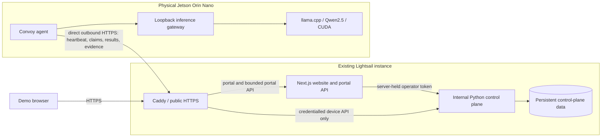

# Production Jetson portal

The entry point is [deployconvoy.com/portal](https://deployconvoy.com/portal),
reachable through **Open demo** on the landing page. The operator supplies demo
credentials privately. This document contains no reusable credentials.

## Scope and evidence

The portal exposes a single configured physical device. Its useful actions are
reading device state and measurements, sending text Chat requests, reading
received usage counters, and inspecting a bounded sample of inference traces.
There are no public deployment, enrollment, model-switching, fleet, or
administrative controls.

| Configuration | Verified scope |
| --- | --- |
| Device | Project NVIDIA Jetson Orin Nano Developer Kit Super, 8 GB |
| Model | Qwen2.5-1.5B-Instruct, Q4_K_M GGUF |
| Runtime | llama.cpp, CUDA offload on 29/29 layers |
| Context | 2,048 tokens |
| Chat output | At most 128 tokens per request |
| Input | Text-only user and assistant messages; at most 16 messages and 8 KiB of text per request |
| Conversation | Completed turns are included in the next request while this portal remains open in the browser tab |
| Controller | Chat has no robot controller or motion-control interface |

The preserved [physical verification record](../control-plane/docs/VERIFICATION.md#browser-chat-on-the-physical-nano--source-4df467b)
records actual two-turn Chat and matching trace/usage evidence. The
[Jetson guide](../control-plane/docs/JETSON_GUIDE.md#9-what-has-and-has-not-been-verified)
records the configuration and its bounded hardware acceptance. Those records
are historical observations; the portal reads current device state at runtime.
No recorded smoke result is promoted to a general performance guarantee, fleet
qualification, or robot-motion result.

**Deployment acceptance:** the portal's production build, browser contract tests,
responsive/accessibility checks, and server API tests can be verified locally.
The public AWS connection and a fresh browser-to-device conversation require
separate live acceptance by the operator. The topology below describes that
production deployment; passing contract fixtures does not prove the public path.
Record the deployed revision and live verification separately when rollout is
complete.

## Architecture

All AWS services below run on the existing Lightsail instance. There is no new
instance, managed database, load balancer, or other AWS resource in this design.
The website's existing public HTTPS origin remains the entry point.



The agent initiates the connection to AWS; the cloud does not connect to a public
inference port on the Jetson. The model gateway remains loopback-only on the
board. Production operation does not require a Mac relay or an SSH reverse
tunnel. The control plane's operator API is internal; only the credentialled
device routes and the narrow browser portal surface cross the public boundary.

The portal API holds the operator token on the server. It validates the configured
device identity and its explicit `simulated: false` flag, checks the active release,
and returns a curated data transfer object. Browser callers cannot select another
device, request an arbitrary upstream path, read raw logs or arbitrary attributes,
or invoke deployments. Fleet usage totals and simulator records are discarded.

The browser surface is deliberately small:

| Route | Purpose |
| --- | --- |
| `GET /api/portal/session` | Check the current demo session |
| `POST /api/portal/session` | Sign in with privately issued email/password |
| `DELETE /api/portal/session` | Sign out |
| `GET /api/portal/snapshot` | Read the configured physical device, release, telemetry, usage, and inference sample |
| `POST /api/portal/chat` | Submit a bounded text request for the observed release |
| `GET /api/portal/chat/:requestId` | Retrieve that session's request status and result |

Session and backend-token configuration is documented in the
[portal API reference](../website/src/lib/portal/README.md). Runtime secrets use
server-only environment variables. They must never be placed in a `NEXT_PUBLIC_`
variable, client bundle, screenshot, test fixture, or committed deployment file.

## Chat request and recovery

```mermaid
sequenceDiagram
  participant B as Browser
  participant P as Portal API
  participant C as Internal control plane
  participant J as Jetson agent
  participant M as Local model runtime
  B->>P: POST text, client UUID, expected release
  P->>C: Validate device; map UUID to demo session
  C-->>P: Queued request
  P-->>B: Request status
  J->>C: Outbound claim poll
  C-->>J: Claimed text request
  J->>M: Local inference
  loop While pending, every 500 ms
    B->>P: GET same client UUID
    P->>C: Read mapped request
    C-->>P: Queued or running
    P-->>B: Curated status
  end
  M-->>J: Complete response and measured timing
  J->>C: Credentialled result delivery
  B->>P: GET same client UUID
  P->>C: Read final result
  C-->>P: Succeeded, failed, or expired
  P-->>B: Curated final result
```

The UI shows the complete model reply when it is available. It does not stream
or fabricate response tokens. Queued, running, succeeded, failed, and expired
states come from the backend. Submitting and confirming are browser transport
states; they are not presented as accepted device execution.

Two timing values remain distinct:

- **Browser round trip:** elapsed time from Send until this browser receives a
  final result. It includes network, relay, waiting, and browser polling.
- **On-device latency:** the gateway measurement reported with that request.
  It excludes browser and cloud-relay time. It is not interchangeable with
  the browser clock or a pure token-generation benchmark.

After an uncertain submission, the browser reads the same request UUID. It never
repeats the POST automatically. A paused or missing request offers **Resume
checking**. Starting a new chat discards this tab's conversation; it does not
cancel work already accepted by the device. A release change requires a new
conversation. Reloading, leaving the portal, or signing out clears the in-memory
browser history; the operator control plane may retain request/evidence records
according to its own storage lifecycle.

## Walkthrough

1. Open the [landing page](https://deployconvoy.com/) and choose **Open demo**.
   Sign in with credentials provided privately by the operator.
2. On **Device**, check the device name, current release, readiness, and the times
   of the last device contact, observed state, and telemetry sample. These are
   different observations and do not share an invented timestamp.
3. Inspect CPU utilization, memory available, temperature, and power. Expand
   **Inspect telemetry samples** to see exact received values and timestamps.
   Missing readings remain **Not reported**. They are never replaced by zero.
4. Open **Chat**. A short context exercise is to tell the model the name of a rover,
   then ask for that name in the next message. The actual reply is whatever the
   running model returns; a particular answer or duration is not promised.
5. Observe queued/running states and the completed reply. Compare the browser
   clock with on-device latency and the reported input/output token counts.
   **Inspect trace** opens matching received evidence when it is in the sample.
6. On **Usage**, inspect counters for this device over the displayed 30-calendar-day
   UTC window, inclusive of today. Compare inference busy time with runtime and
   agent running time without adding these overlapping durations together.
7. On **Traces**, inspect the received inference sample, its exact records, and
   measured latency summary. New evidence may arrive after the Chat response;
   use **Refresh** if the matching trace is not present yet.
8. Sign out when finished. Offline or stale data is displayed as such; refresh
   failures never turn into fabricated measurements or a generated answer.

## What the numbers mean

**Device telemetry.** The current implementation requests at most 120 received
samples. It plots their real timestamps, with dots for samples and open gaps for
missing values or long intervals. The stale threshold is read from the control
plane when available. If no threshold is reported, the chart uses an explicitly
labelled 30-second visual gap rule; that rule does not establish device health.
The latest value, the device contact time, and the snapshot fetch time are separate
facts. The browser refreshes the snapshot every ten seconds while visible.

**Usage.** The API requests the last 30 UTC calendar dates, including today, and
selects only `devices[].metrics` for the configured physical device. It does not
use fleet totals or global daily buckets. Counters are based on received usage
records; offline buffering and later delivery can revise them. Missing values
are unknown; recorded zero remains zero. Unknown coverage records explicitly
unobserved time. Inference busy, runtime running, and agent running clocks overlap,
so the UI does not sum them or invent a utilization percentage or cost estimate.
Usage includes other recorded inference on this same device, not just this tab.

**Traces.** The UI reports the actual returned sample count. The current API reads
at most 100 recent spans, selects gateway inference spans, and returns up to 20
of those in newest-first order. This can include recorded inference outside the
demo Chat session. The latency chart covers only available measured values in
that received sample. Missing latency is excluded from quantiles, not changed to
zero. Median averages the two middle values for an even sample. p95 uses the nearest-rank value; for small samples it can be the maximum.
The displayed sample is not an all-time percentile, benchmark, or completeness
claim. A missing selected trace may still be uploading or may have aged out of
the bounded window.

## Development and validation

The portal uses the existing Convoy semantic colors, self-hosted IBM Plex fonts,
small-radius controls, and keyboard focus styles. It works with the landing page's
responsive layout and reduced-motion preferences.

From `website/`:

```bash
pnpm install --frozen-lockfile
pnpm run typecheck
pnpm run lint
pnpm run check:tokens
bash scripts/test-portal.sh
pnpm run build
pnpm exec playwright test tests/e2e/portal.spec.ts --project=chromium
```

The portal browser suite uses explicit contract fixtures confined to test files.
It verifies sign-in/out, truthful request states, uncertain-submit reconciliation,
context retention, failed/expired requests, offline blocking, bounded input,
keyboard controls, measurement provenance, accessible tables/charts, and responsive
reflow at 320, 390, 768, and 1440 pixels plus 200% text enlargement. It is a software
contract check; real device and public HTTPS acceptance must be verified separately.
