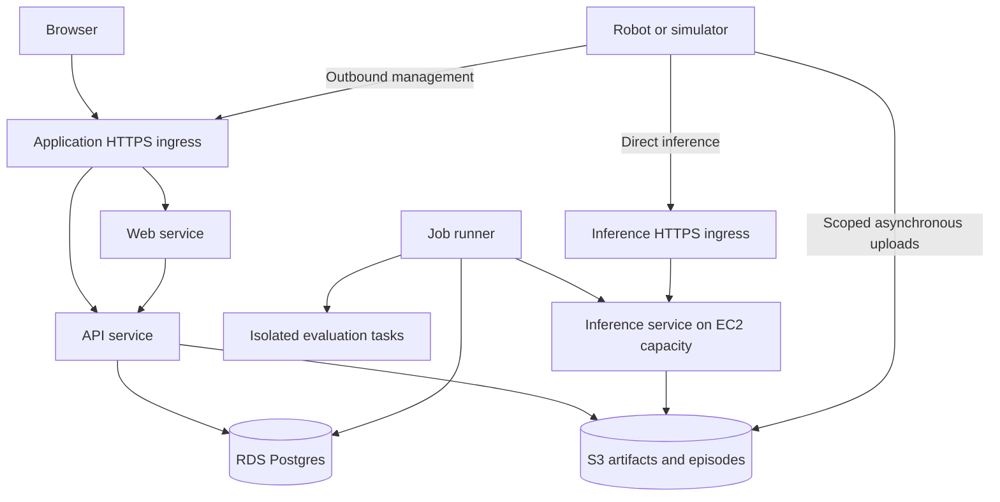

# Convoy v1 implementation plan

September 27, 2026 · Proposed execution and hosting plan

Companion: [Platform design](platform-design.md). This plan describes future implementation. The initial branch checkpoint contains documentation only; it does not provision infrastructure, change production, or demonstrate passing application tests.

## 1. Working agreement and current evidence

Develop on `v1` in an isolated Git worktree based on `main` commit `11a8b6532f86a2c816a648309936a2592933e5fb`. Keep commits small enough to review and restore independently. Each milestone should deliver observable behavior across the system rather than a collection of empty abstractions.

The repository already contains useful enrollment, immutable text-model releases, deployment journals, recovery, evaluation gates, a Next.js portal, and an outbound Python agent. Preserve those foundations while adding the robot-application lifecycle. Existing tests protect real failure modes; reducing test bloat does not mean discarding that evidence.

Verified during planning:

- GitHub access reports repository administration permission; reading the remote works. Branch write is verified separately by pushing this documentation checkpoint.
- `v1` was absent locally and remotely before worktree creation.
- Node, pnpm, uv, and Docker CLI are installed. The local Docker daemon is not running. Local tool versions differ from CI, so bootstrap must pin project tools without changing global installations.
- Current CI runs on relevant pull requests, not ordinary `v1` pushes.
- Production automatically deploys relevant `main` changes. Manual deployment currently has no branch guard. A merge into `main` is therefore a deployment decision, not merely bookkeeping.
- No live AWS role, GPU quota, model entitlement, DNS permission, or robot access has been verified for v1. Historical deployment records do not establish current access.

## 2. Implementation milestones

| Milestone | Concrete result | Exit evidence |
|---|---|---|
| M0: Reproducible branch and checks | Pin tools; record a baseline; add relevant `v1` push checks; guard production deployment; provide consistent development/check commands | Existing applicable checks recorded with skips/failures explained; v1 code push runs tests and cannot invoke the production release path |
| M1: One controlled mission | Shared execution contract, robot/application identity, local coordinator, scripted planner and deterministic robot adapter, minimal mission UI/API | Start → accepted → running → outcome; cancellation, late reply, duplicate, and restart cases work through real Convoy processes |
| M2: Hosted data foundation | Postgres migrations, organization/project ownership, role checks, durable outbox/jobs, artifact abstraction | Fresh/upgrade migration, competing-worker claims, tenant isolation, and restore/import fixtures pass against real Postgres |
| M3: Real simulation and inference | Pinned Nav2/Gazebo inspection application, one local component, independent model worker, first provider connector | Same lifecycle with actual inference; task failures distinguish model, transport, deadline, and execution problems |
| M4: Repeatable release operations | Candidate → evaluation → promotion → deployment → mission; paired activation; episode comparison and rollback | Update model/configuration, compare baseline, deploy to first robot, interrupt activation, reconcile or recover to a compatible bundle |
| M5: Pilot operations | Capture/retention, quotas, signing, credential lifecycle, metrics/alerts, isolated staging, deployment and restore runbooks | Complete staging acceptance and partner commissioning with explicit gaps; second customer release uses the same machinery |
| M6: Demonstrated portability | Second robot/task family and second provider or customer environment | Core lifecycle reused without a customer-specific fork; publish the actual supported combinations |

Security and tenant ownership enter the first schemas and APIs. M2 must complete before hosting multiple customers or accepting customer data; it is not a cleanup task after launch. M1 can use the existing single-installation database locally while the deliberate Postgres conversion proceeds.

M3 need not wait for GPU provisioning to begin: a separately hosted CPU runtime or controlled worker can establish the interface. Target-model latency claims require the actual intended compute. Timing estimates will follow baseline execution and the first slice; milestone acceptance is more reliable than a speculative calendar for the whole platform.

The first useful product checkpoint is a mission that can be started, observed, cancelled, and recovered. The first commercially useful checkpoint is a customer repeating the release workflow for their next model version.

## 3. Repository organization and dependency direction

Keep the current top-level repository structure and add packages only when their behavior exists. The following is a target layout, not a request to create empty directories.

```text
website/
  src/app/                         route entry points
  src/features/                    robots, applications, releases, missions, episodes
  src/lib/api/                     generated client and small transport/auth wrapper
control-plane/
  contracts/convoy_contracts/       independent versioned wire contracts and fixtures
  server/convoy_server/
    applications/                  application revisions and resolved releases
    deployments/                   target reconciliation and rollout rules
    missions/                      request admission and mirrored execution state
    services/                      existing services; move only as ownership changes
  agent/convoy_agent/
    coordinator/                   local session/mission state and proposal admission
    adapters/runtime/              existing llama.cpp implementation behind interface
  worker/convoy_worker/             direct inference process, added at M3
integrations/
  ros2/                            optional robot adapter and ROS dependencies
  providers/                       provisioning integrations when implemented
examples/mobile-inspection/        pinned application, world, scenarios, scorer
infra/
  dev/                             local environment and named volumes
  aws/                             infrastructure code and per-environment variables
docs/v1/                           current design, plan, progress and decision records
```

Rules for changes:

1. HTTP/UI entry points call application services. Application services own transactions and state transitions. Concrete database, provider, runtime, and robot implementations sit behind narrow interfaces.
2. Shared contracts import no server, ORM, ROS, or cloud SDK. The current server imports some pure agent helpers; extract shared definitions as their behavior changes rather than duplicating them or making the agent depend on the server.
3. Preserve the base agent's Python 3.10 installability and lean dependency set. ROS and heavier execution transports belong in optional packages/processes. Server-only provider libraries never ship to every robot.
4. OpenAPI defines management client types. A versioned execution schema defines agent/worker messages. SQLAlchemy models define persistence. Avoid three manually synchronized copies of one wire format.
5. Keep domain rules explicit. A few typed functions and small state machines are preferable to inventing a universal workflow, plugin, or repository framework.
6. Tests live with the owning package; cross-process scenarios share one small harness. Name new tests by behavior, not by review round or implementation helper.
7. Add abstractions around demonstrated external boundaries. Do not build generic humanoid action interfaces until a real adapter defines their semantics.

Use additive migrations and compatibility windows. Old release IDs retain their meaning. Database schema versions, wire versions, agent versions, and robot-application releases remain distinct. Application rollback does not imply database downgrade.

Postgres needs dedicated transaction, fencing, migration, and backup work: existing code uses SQLite-specific transactions, file locks, and PRAGMAs. Keep edge SQLite journals. Start v1 staging with an empty database and synthetic data; importing demo/customer history is a separate, rehearsed operation using a copy, never live dual writes.

## 4. Actual service topology

The initial hosted system has three continuously running CPU service types, an independently managed inference service, and on-demand evaluation jobs. Identity, catalog, missions, and evidence are modules in the API initially. This keeps ownership clear while allowing independent scaling where resources and failure modes differ.

| Service/process | What runs there | Hosting decision | Access boundary |
|---|---|---|---|
| Web | Next.js console and browser session layer | ECS Fargate CPU service | Public HTTPS; calls API with the user's scoped identity |
| API | FastAPI inventory, catalog, deployments, missions, bounded evidence ingest, authorized object grants | ECS Fargate CPU service | Public authenticated robot/API routes; private service access; Postgres and permitted S3 prefixes |
| Job runner | Durable reconciliation, deployment steps, compute requests, retention, evaluation dispatch | Separate Fargate service using the server codebase with a different entry point | No public inbound endpoint; scoped DB and provider task role |
| Inference worker | Session admission, model/runtime adapter, model process | ECS on an EC2 GPU capacity pool when GPU is required; CPU worker for suitable workloads | Dedicated authenticated inference endpoint; permitted model/artifact reads; no mission database or broad provisioning credentials |
| Evaluation runner | Short-lived pinned scenario/scorer execution | Isolated ECS tasks on CPU or a separate suitable GPU pool | Restricted job-specific data; no production deployment identity; privileged packet tests use an isolated Linux runner |
| Robot agent and coordinator | Enrollment, staging, journal, local sessions, proposal checks, existing robot adapter | Linux service on customer robot/site machine; containerized simulator in development | Outbound TLS; constrained local controller interface; local durable journal |

The job runner launches and reconciles evaluation tasks; it does not execute arbitrary customer evaluation code inside its privileged process. Untrusted jobs and mutually untrusted customers do not share a privileged GPU host by default. A worker/container identity is not a substitute for host isolation.



Inference does not travel through Next.js, the management job queue, or Postgres for every decision. Worker authorization can continue under a bounded cached session policy during management loss. The model itself is private behind the worker's admission boundary.

Logical modules can share a database initially. API and job runner coordinate through transactional records/outbox and leased jobs; no Redis, Kafka, or separate workflow cluster is required for the first supported load. Extract a module into its own service when measured traffic, isolation, or release ownership requires it. Record what changes in consistency and failure handling when doing so.

## 5. Hosting and infrastructure decisions

**Planning default: AWS for the first hosted environment**, because the existing product already uses it. This does not establish current account permission or require inference customers to use AWS. Provider-specific implementation remains behind the compute adapter. Region is selected from the first site's path measurements, data constraints, and available GPU capacity before provisioning.

| Area | V1 decision | Reason and change condition |
|---|---|---|
| Local development | Native web/Python dev processes plus a pinned Postgres container; optional Linux simulator containers. Local artifact backend for cheap development, real S3 contract checks in staging | Enables CPU-only contributions. Local artifacts do not prove S3 access/security behavior. Docker must be running, or use an isolated Linux development host. |
| CPU hosting | ECS Fargate for web, API, and job runner | Separates deployment and process resources without operating a container cluster. Revisit when cost, custom host requirements, or load justifies it. |
| GPU hosting | One explicitly sized EC2-backed inference pool, initially dedicated to the pilot | GPU/driver/model requirements determine the instance. Warm while a session needs it; drain and shut down development capacity when idle. Do not scale active missions to zero. |
| Database | Managed RDS PostgreSQL; single-AZ staging unless resilience tests require more; Multi-AZ for the commercial availability target | Automated backups and managed operation. Restore must still be rehearsed; Multi-AZ is neither a backup nor proof of application availability. |
| Models and recordings | S3 with tenant-scoped object authorization, retention/lifecycle rules, and encrypted storage | Keeps large data outside Postgres. Choose retention per data class and customer policy. |
| Images | ECR, immutable image digests | Build once and promote the same artifact through environments. Do not deploy mutable `latest` tags. |
| Networking | Separate v1 environment/VPC; private application tasks and database; public TLS ingress; restricted security groups and explicit egress | Robots need outbound connectivity, not public inbound robot ports. Database is never public. Inference ingress is operationally separate from app ingress. |
| Service authentication | User/project identity at API; per-device credentials; scoped session grants at inference workers | The web service must not forward an unrestricted demo operator credential for all customers. |
| Secrets and cloud credentials | Secrets Manager where necessary; distinct task IAM roles; GitHub OIDC for CI deploy roles | Avoid permanent AWS keys in GitHub, robot configs, or repository files. Limit CI role to the environment and relevant refs. |
| Infrastructure as code | Terraform with pinned providers, encrypted remote state and locking; environment-specific plans | Reproducible creation, review, teardown, and drift detection. Start with direct resources and a few cohesive modules. |
| Observability | Structured logs/metrics in CloudWatch, instrumented trace context and typed episode events | Enough to diagnose failed jobs/missions without a separate analytics stack. Set log retention and sampling explicitly. |

AWS documents EC2-backed GPU task scheduling and GPU-optimized images, task-specific IAM roles, and RDS Multi-AZ standby behavior. The choices above are architecture recommendations, not assertions of deployed resources or a measured service level. [ECS GPU workloads](https://docs.aws.amazon.com/AmazonECS/latest/developerguide/ecs-gpu.html), [task IAM roles](https://docs.aws.amazon.com/AmazonECS/latest/developerguide/task-iam-roles.html), [RDS Multi-AZ](https://docs.aws.amazon.com/AmazonRDS/latest/UserGuide/Concepts.MultiAZSingleStandby.html)

Do not reuse the existing production Lightsail host for v1 experiments. The first staging environment is logically and credential-isolated; a separate AWS account is preferred when available, otherwise use a distinct VPC, roles, data stores, and deploy targets. One staging replica per CPU service is acceptable for development. Before claiming the commercial availability objective, qualify redundant web/API placement, worker recovery, database failover, and the selected inference redundancy. Staging configuration is not production resilience evidence.

Private egress is an explicit cost decision: S3 gateway access and the minimum required endpoint/NAT configuration must be included in the infrastructure estimate. NAT gateways, interface endpoints, load balancers, database uptime, logs, storage, and egress can create a meaningful idle bill. Do not count only GPU hours or describe an alert as a hard spending cap.

Before creating billable resources, produce a concrete plan listing region, instance/task sizes, minimum/maximum capacity, storage retention, expected active hours, current provider rates, estimated monthly range, and teardown behavior. Obtain the missing spending constraint and required account access at that point. Application quotas and a cleanup reconciler complement provider budget alerts; neither guarantees a universal instant account-wide spending cutoff.

## 6. Infrastructure access by stage

| Stage | Access needed | Can progress without it? |
|---|---|---|
| Branch, contracts, local mission | GitHub read/write and local runtime | Already sufficient for the initial branch work |
| Database and CPU integration | Running Docker/Linux runner with ephemeral Postgres | GitHub-hosted Linux CI can run the reproducible tests; local Docker availability improves iteration |
| Headless Nav2/Gazebo | Linux container/VM capable of the pinned scenario | Contract robot covers platform behavior meanwhile, with its limits labeled |
| Shared staging | Scoped AWS role, region, environment/DNS permission, CI OIDC setup, budget | Local development can continue; shared hosting waits |
| Real remote model | GPU capacity/quota or authenticated endpoint, supported model artifacts/licenses, compute budget | Use controlled inference for plumbing; do not claim real model performance |
| Edge qualification | Remote target compute such as the intended Jetson, or a partner's board | Desktop tests do not qualify ARM/CUDA/memory/thermal behavior |
| Physical acceptance | Partner robot access, adapter/task owner, task/site constraints | Simulation demonstrates software behavior; physical claims wait for corresponding trials |

Secrets should be configured through the environment's secret store or scoped authentication flow. They should not be pasted into plans, commits, test fixtures, or chat transcripts. No cloud purchase, production migration, or robot operation is part of the documentation checkpoint.

## 7. Lean testing strategy and cadence

**Test the observable risk at the cheapest layer that proves it.** The unit is behavior, not a function count or coverage percentage. Add a second test layer only when it establishes a different property.

| When | Run | Why |
|---|---|---|
| During edits | Lint/type checks and affected behavioral tests | Fast feedback on the actual change |
| Before pushing a code checkpoint | Affected package checks; shared contract fixtures; Postgres integration for persistence changes; mission fault pack for execution changes | Detect regressions before publishing the checkpoint |
| Every relevant v1 push | Linux CPU CI with deterministic adapters, real Convoy processes, and ephemeral Postgres; current-demo checks when shared paths change | Repeatable verification without GPU credentials or model downloads |
| UI integration checkpoint | Production build plus a small browser flow against the actual API and worker | Current mocked portal tests do not prove end-to-end backend wiring |
| Simulator/adapter change and milestones | Short headless Nav2/Gazebo scenario, broader regression suites, restart and migration rehearsal | Tests physical-simulation behavior and cross-module integration |
| Release qualification | Real model on intended compute, load/network sweeps, backup/restore and customer acceptance | Supports the specific performance and hardware claims |

Initial essential scenario pack:

1. Successful mission with accepted/executing/completed states.
2. Unsupported or invalid proposal rejected.
3. Expired/wrong-release/wrong-epoch response rejected.
4. Cancellation racing a returned proposal.
5. Duplicate request/result and lost acknowledgement.
6. Agent/coordinator restart with a command whose outcome is uncertain.
7. Management outage while following the authorized local policy.
8. Interrupted deployment and compatible recovery.
9. Cross-tenant read/write or execution request denied.

Use parameterized cases and shared fixtures. Add disk pressure and evidence-gap cases when that path is implemented. Prefer explicit synchronization or controlled clocks to arbitrary sleeps; keep some real-process shutdown/reconnect tests to prove actual behavior.

Small unit tests are worthwhile for consequential pure rules: deadline conversion, authority checks, allowed state transitions, content hashing, and deterministic scoring. Avoid getter tests, implementation-shaped mocks, large UI snapshots, duplicate assertions across layers, and tests added solely to raise a coverage percentage. Preserve existing regression tests unless a replacement proves the same risk more clearly.

Postgres tests must run real migrations and transactions. Cover fresh install, prior-schema upgrade, concurrent claim/fencing, rollback/outbox consistency, tenant isolation, and recovery after worker loss. Use generated representative SQLite import fixtures initially; later rehearse with a private copied snapshot. A passing SQLite suite cannot qualify Postgres concurrency or backups.

Keep three distinct labels in reports: deterministic contract robot, physics-based simulator, and physical robot. An application impairment proxy supplies portable CI fault cases; Linux packet-level `netem` tests run separately on an isolated runner. GPU and privileged network tests are explicitly selected qualification jobs, not prerequisites for editing a console form.

## 8. CI, commits, pushes, and release discipline

For the first engineering commit, add a v1 push trigger and explicit production ref/environment controls. Include new contract/integration/infra paths in change detection. Avoid running identical full jobs twice for the same push/PR unnecessarily. Required checks must report a clear result even when some path-specific jobs are skipped. Untrusted pull-request code must not receive deployment secrets.

Use the same underlying test commands locally and in CI. Add a small wrapper only to make those commands easier to discover; do not invent a new test framework. Existing verification entry points include:

```text
control-plane:
  uv sync --frozen --all-packages
  uv run --frozen ruff check server agent
  uv run --frozen pytest -q server/tests
  uv run --package convoy-agent pytest -q agent/tests

website:
  pnpm install --frozen-lockfile
  pnpm run typecheck
  pnpm run lint
  pnpm run check:tokens
  bash scripts/test-portal.sh
  pnpm run build
  pnpm run test:e2e
```

Use the repository-pinned package manager and CI-supported runtimes. The current website `verify` command does not include the portal contract script; fix that wrapper or keep the missing check explicit. Record legitimate optional skips rather than calling them passed. Legacy browser tests that depend on retired UI artifacts do not count as coverage of the new console.

For each implementation checkpoint:

1. Inspect current branch/diff and remote changes; keep unrelated work intact.
2. Complete one coherent behavior, its necessary tests, migrations, and documentation.
3. Run the applicable checks. Fix regressions introduced by the change; distinguish pre-existing or unavailable-environment failures explicitly.
4. Commit with a behavior-oriented message and push `HEAD` explicitly to `refs/heads/v1`, with upstream tracking. Use normal pushes; never overwrite a newer remote branch with a force push.
5. Read CI results for that exact commit. A successful Git push is not a successful build. If checks fail, fix and push a follow-up commit.
6. Report the commit, demonstrated behavior, test results/skips, and any infrastructure or decision changes.

Create a draft comparison PR when the first code slice is reviewable. Keep its description current with implementation and validation. Do not merge into `main`, dispatch the production release workflow, or migrate production as an incidental step in branch development. Stage only tested, immutable image digests. Deploying a CPU service and starting a robot mission remain separate operations.

For changes requiring hosted validation, deployment order is: compatible database expansion → API/worker update → web update → supported agent rollout → later schema contraction after the rollback window. Run migrations once as an explicit deployment job, not concurrently from every service startup.

## 9. Infrastructure decision records and progress reporting

Record each significant decision in a short file under `docs/v1/decisions/` when it is made. Include the problem, chosen option, alternatives considered, expected cost, security/operational effects, evidence, and the condition that would trigger reconsideration. Do not create a document for every routine library import.

The first decision records should cover: service boundaries; Postgres migration/tenancy; first compute provider and region; GPU sizing/warm capacity; network/egress; and artifact/data retention. Infrastructure pull requests include the plan/diff and a current cost estimate, while teardown and data-retention behavior remain explicit.

Maintain a compact progress log with milestone, commit, demonstrated behavior, exact test scope, known gaps, and current infrastructure. Update it at useful checkpoints rather than after every edit. This makes future iterations possible without relying on conversation history.

## 10. Initial checkpoint boundary

This checkpoint establishes the isolated branch and versioned design/implementation documents. Validation is documentation integrity and a clean, correctly targeted Git push. The baseline application suites, CI changes, hosting, and first mission slice are subsequent implementation milestones; none are implied complete by the presence of this plan.
