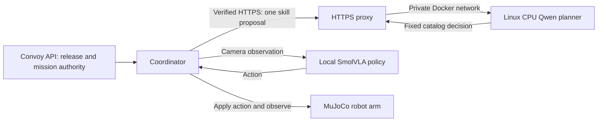

# Convoy: separate planner and action-policy services

**Passed:** one real Qwen proposal over verified HTTPS, followed by **54 successful SmolVLA actions**, each exactly matching the direct baseline. Clean source `59f27548d46a30c6df2cd6f9dba248b3f1994ec2`; [PR #93](https://github.com/useconvoy/app/pull/93).

Qwen took 19.53 seconds within the original 30-second planning budget. The mission took 68.33 seconds for 0.675 simulated seconds; total pipeline time including startup was 83.68 seconds. This is offline execution, not real-time control. All owned resources were cleaned up; all eight pre-existing services were unchanged.

The planner runs inside the qualified Linux ARM64 container. An HTTPS proxy
exposes it only to this computer through a dedicated ingress bridge. The planner
joins only a separate internal network and has no published port.
The API, coordinator, learned action policy and simulator run as separate local
processes. The API alone holds private mission-signing keys; each model service
receives only the public authority needed for its own role.



The task is the pinned seed-0 puck pick-and-place scene. Qwen selects the sole
qualified skill; SmolVLA generates the actual camera-conditioned actions. This
checks that Convoy can admit a plan from a separately hosted process and carry it
through a learned-policy simulation. It does not demonstrate open-ended planning
or prove that arbitrary models and robots are compatible.

The client verifies the proxy's hostname and an ephemeral private CA. TLS ends
at the proxy; its upstream connection is HTTP within the private Docker network.
The proxy does not retry model requests. A wrong CA must be rejected before any
local services or actions start. The successful response must match the release,
mission, observation, original deadline and current serving process identity.

## Testing and reproducibility

Nineteen focused endpoint, credential and existing planner-helper checks pass.
The new checks are part of the existing CI job and require no model downloads.
The simulation workflow's Ruff check also passes. Real-model acceptance uses
previously verified local weights and immutable images; it never downloads them
or changes the user's existing services.

Three initial attempts stopped before planning or robot execution. The first
exposed the upstream proxy binary's required `NET_BIND_SERVICE` file capability;
the second exposed host-owned private files copied into a container with dropped
DAC capabilities. The third exposed this Docker Desktop setup's lack of a
published port when the proxy joined only the internal network. Separate proxy
checks confirmed the capability, ownership and two-network fixes. The
final harness retains only the required capability and supplies an allowlisted
archive with explicit container ownership, preserving mode-0700 directories and
mode-0600 private files. Failed runs and their cleanup evidence remain retained.

## Scope

This is local Docker Desktop networking and CPU inference, with one seed in
offline lockstep. It does not establish internet latency, cloud capacity,
Jetson execution, physical controller safety or a real-time control deadline.
An actual cloud trial still needs authenticated account access, a reviewed
endpoint/cost plan and hosted acceptance. The saved SSH key has not authenticated
to the Jetson, so its current model and hardware state remain unverified.

## Repeat the network qualification

Use the pinned action-policy environment with the paired extra, the previously
verified action assets, the qualified Linux planner image, and the pinned Caddy
image already installed. The harness never pulls images or downloads weights.

```sh
uv run --project integrations/lerobot --frozen --extra paired \
  python examples/manipulation/network_planner.py \
  --planner-image sha256:21b6b05064cf8a44f02439e64ba34f1368fe379eac4c0e70ecb36afb3e0f3a11 \
  --action-assets /private/qualified-action-assets \
  --direct-report /private/direct/report.json \
  --direct-trace /private/direct/episode.jsonl \
  --output /private/new-network-proof
```

Existing pipelines may instead supply their own HTTPS URL, explicit CA path if
needed, probe token and existing API signing-key file to `pipeline.run`. The
pipeline checks the release before starting its owned local processes. Its
caller remains responsible for the external planner lifecycle.

Hosted GitHub jobs could not start because the account reported a billing or
spending-limit problem. No hosted CI success is claimed.
