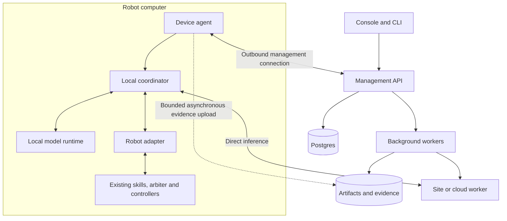
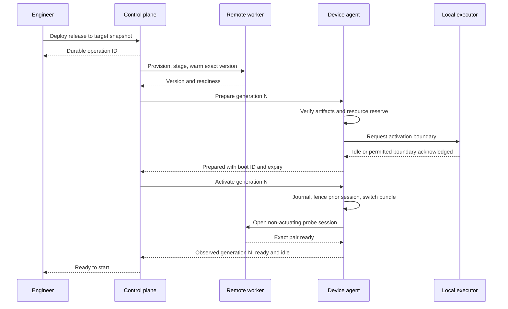

# Convoy platform design

Proposal v0.2 · September 27, 2026 · Requirements, architecture, interfaces, implementation, and critical flows

This is the platform proposal for the v1 branch. The [implementation plan](implementation-plan.md) defines sequencing, testing, repository organization, and hosting decisions. It specifies work to build; it does not claim that these APIs, performance targets, simulations, or robot integrations have been implemented or validated.

Convoy helps robotics teams **package, evaluate, deploy, and operate robot intelligence across onboard, site, and cloud compute**. Customers retain their robot controllers and task expertise. The product supports autonomous systems and optional human intervention. Neither teleoperation nor a cloud dependency is required.

The first executable simulation reference is now robot-arm manipulation in MetaWorld/MuJoCo, selected by the user after this design was drafted. Start with a labeled scripted baseline, then a qualified learned action policy; see [decision 001](decisions/001-simulation-reference.md). Mobile navigation with a slower remote planner remains a second application, and its goal/skill examples below remain useful design examples. DimOS, Dora, proprietary industrial stacks, and humanoid stacks are adapter candidates, not mandatory dependencies. Prove a second integration before advertising broad portability.

## 1. Functional requirements

The primary user is a robotics or deployment engineer. An operator starts authorized tasks and examines failures; an administrator controls access and infrastructure. A useful customer already has an executable skill or policy interface. Convoy does not supply missing locomotion, manipulation skill, or task understanding simply by hosting a model.

“V1” means required for the first sellable pilot. “Next” identifies planned extension points rather than existing support.

| ID | Requirement | V1 behavior and acceptance evidence |
|---|---|---|
| F01 | Organizations, projects, sites, and permissions | Engineers create applications; deployers promote releases; operators run approved tasks; viewers inspect permitted evidence. Every resource and action is tenant-scoped and audited. |
| F02 | Register robots and compute | Enroll an agent with a short-lived token; discover hardware, software, and adapter capabilities. Physical and simulated robots have distinct labels and identities. Unknown capability is shown explicitly. |
| F03 | Connect the existing robot stack | An adapter exposes observations, available skills, task state, execution acknowledgements, and recovery behavior. V1 supports one tested goal/skill contract. |
| F04 | Define a robot application | Describe components, interfaces, placement, resource requirements, task parameters, timing, and outage policy. Local-only applications use the same lifecycle as hybrid applications. |
| F05 | Bring and package models | Register weights, runtime image, preprocessing, tokenizer/normalization, output interpretation, and dependencies. Resolve immutable digests and reject incompatible hardware or contracts. Arbitrary uploaded weights are not automatically supported. |
| F06 | Connect compute locations | V1 uses one Convoy-managed provider and one robot runtime. An adapter separates provisioning from inference. External endpoints come next; site compute and BYO environments implement the same worker contract. |
| F07 | Qualify a release | Run interface, timing, task, resource, and fault tests against a pinned candidate and environment. Store comparison with a baseline and show qualification scope and missing evidence. |
| F08 | Deploy and recover | Stage compatible components, warm them, activate at an acknowledged application boundary, and report per-robot observed versions. Support a first-robot rollout, pause, and compatible rollback. |
| F09 | Start and supervise tasks | Start a mission only on a ready robot with local execution authorization. Pause/cancel are requests with acknowledgement and completion states. Mission start is separate from deployment. |
| F10 | Coordinate inference | Use direct robot-to-worker sessions, bounded queues, deadlines, and typed proposals. Reject stale, incompatible, duplicate, or unauthorized results before execution. |
| F11 | Observe outcomes | Connect release → mission → observation → inference → accepted command → outcome. Show complete-result latency, task success, deadline misses, resource use, and available cost data. |
| F12 | Capture and reuse evidence | Configure payload capture and retention; spool within bounds; export authorized episodes. Convert a failure into a versioned evaluation case. Training stays an external workflow initially. |
| F13 | Integrate optional human participation | Permit existing operator software to take authority through the robot's arbiter. Record the transition and reject prior autonomous proposals. Building a teleoperation console is a later, optional product. |
| F14 | Control capacity and cost | Apply concurrency, storage, compute, and spend limits. Show attributed usage and whether cost is estimated or reconciled. Stop admitting new work before exhausting a configured budget; handle current tasks through their defined recovery policy. |
| F15 | Explain network suitability | Measure the robot-to-endpoint path and classify an application's supported network envelope. Radio-controller integration is optional and separately qualified. |

The common commercial deliverable is a repeatable release workflow: a customer supplies a useful application, Convoy makes its next release easier to validate, deploy, diagnose, and recover. A pilot selects one primary outcome, such as deployment engineering hours or diagnosis time, while guarding task quality and timing against regression.

## 2. Nonfunctional requirements

These are design targets and acceptance rules, not measured results or customer SLAs. Record the hardware, model, payload sizes, concurrency, network conditions, and sample counts with every performance claim.

| ID | Requirement | Proposed target or invariant | How to verify |
|---|---|---|---|
| N01 | Execution authority | One acknowledged owner per command resource; only the local arbiter/executor can grant it. No old boot, coordinator incarnation, mission, release, or authority epoch may actuate. | Fault tests inject duplicates, late results, takeover, and process restarts. |
| N02 | Deadline correctness | Robot-local monotonic time determines whether a result remains usable. Expired proposals are never newly submitted for execution. Physical recovery is task-specific. | Clock jumps, slow inference, queueing, and delayed delivery tests. |
| N03 | Bounded latency | Each contract declares a complete-valid-result deadline and maximum observation age. Initial inspection example: 2 seconds for each; this is a test hypothesis, not a servo deadline. | Report miss rate over all requests, latency distribution, and task outcomes under nominal and stressed conditions. |
| N04 | Platform overhead | Initial engineering budget: p99 ≤ 50 ms for total measured Convoy validation, envelope handling, admission, and dispatch spans in the reference test. Excludes model execution, sensor processing, transport, and physical control. | Reference test with 10 simulated robots, ≤ 1 decision/s/robot and ≤ 256 KiB encoded observation/request. Measure each span; revise placement or implementation if exceeded. |
| N05 | Management responsiveness | Proposed p95 < 500 ms for metadata reads and durable operation acceptance at 20 API requests/s. Healthy connected agents should receive new intent within 5 seconds. | Load test separately from artifact transfer, builds, provisioning, and inference. Receipt does not imply completion. |
| N06 | Management independence | Existing missions do not require a per-decision call to the control plane. A control-plane outage respects cached authorization, expiry, and local recovery rules. | Disable management during an active simulated mission, including authorization expiry. |
| N07 | Honest availability | Track management, worker readiness, robot reachability, and task success separately. Candidate commercial management objective: 99.9% monthly; validate operations before committing. No generic WAN or task-success guarantee. | Availability probes, dependency failures, recovery drills, and outcome evidence. |
| N08 | Recovery and durability | Persist accepted operations before acknowledgement. Proposed commercial control-plane recovery objectives: RPO ≤ 5 minutes, RTO ≤ 1 hour. An ambiguous physical action becomes `unknown`, not automatically replayed. | Database restore exercise and crash injection at each activation/execution boundary. |
| N09 | Resource isolation | Bound every queue, payload, recording spool, and retry loop. Reserve device disk for the operational journal; preserve customer controller CPU/memory needs. | Saturate logging, network, inference queues, memory, and disk while checking local behavior. |
| N10 | Security and privacy | Per-device identity, encrypted links, least privilege, artifact integrity, isolated customer workloads, scoped secrets, and explicit capture/export/retention controls. | Tenant isolation, revocation, malicious artifact, and unauthorized evidence-access tests. |
| N11 | Reproducibility | Exact component and configuration digests identify a release. Qualification identifies its environment and suite. Changes create new immutable records. | Rebuild/install from manifests; compare actual loaded digests; reject mutable tags as release identity. |
| N12 | Initial scale | Qualify 1–10 active robots per pilot site. Compute load is part of the qualification, not inferred from registration count. | Repeat 1/5/10-robot tests with combined model and network load. |
| N13 | Extensibility | A second robot integration and provider pass the contract suite without a fork of the core release/deployment lifecycle. | Second-customer installation and provider conformance exercise. |
| N14 | Evidence completeness | Operational events are sequenced and deduplicated. Missing ranges, sampled payloads, and dropped recordings are visible. | Disconnect/reconnect, duplicate upload, retention, and disk-pressure tests. |

Zero violations in a finite invariant test suite is required for release admission; it is not evidence of zero physical risk. Existing certified safety functions, protective stops, and actuator watchdogs remain in the robot's control system. A cloud pause button is an operational request, not an emergency-stop mechanism. ROS 2's controller manager illustrates the existing hardware/controller loop that Convoy should integrate above. [Controller manager documentation](https://control.ros.org/rolling/doc/ros2_control/controller_manager/doc/userdoc.html)

## 3. Domain model and system boundaries

Use **Application → Release → Deployment → Mission → Episode** as the product vocabulary.

| Object | Meaning and source of truth |
|---|---|
| Organization / Project / Site | Ownership, access, and installation context; control plane owns configuration. |
| Robot | Logical physical or simulated machine and its command resources. One primary edge device in V1; future robots can attach several compute devices. |
| Device | Agent identity, boot ID, observed hardware, software, and health. Replacing a computer does not silently create a new physical robot or inherit actuation authority. |
| Connection | Provider account or endpoint connector, allowed regions/networks, capability profile, and secret references. |
| ApplicationRevision | Frozen component graph and task contract derived from an editable application draft. Includes classical components as well as models. |
| Release | Immutable resolved artifacts, interface versions, configuration, placement constraints, and policy digests. It is initially a candidate. |
| Qualification | Append-only evidence for a release digest × hardware/adapter/network environment × suite revision. `passed`, `failed`, or `inconclusive`. |
| Promotion | Authorization to use a release within a specified qualified envelope. Separate from the release's content and from permission to move a robot. |
| Deployment / Target | Requested release and bindings; target robot IDs are snapshotted. Each target has a desired generation and independently reported observed state. |
| Operation | Durable long-running management action, its retries, step outputs, cancellation request, and terminal outcome. |
| Mission | One task execution on one robot in V1, pinned to a release and bounded authorization. Local executor owns actual progress. |
| Session | Robot boot, coordinator process incarnation, release, mission, authority epoch, worker identity, and negotiated capabilities. Probe sessions cannot submit executable decisions. |
| Episode / Event / Outcome | Evidence of a trial or mission, ordered within each producer stream. Outcome records identify the evaluator/controller/operator that supplied them. |

Qualification is attached after a candidate is built, avoiding a circular digest between a release and the evaluation that tests it. A hardware, adapter, or network change can invalidate the applicable qualification without changing the original report. A hosted endpoint with an unpinned upstream model is labeled accordingly and cannot receive the same reproducibility claim.

Separate three paths:



Management handles desired state. Execution connects the robot directly to the selected worker. Evidence uploads asynchronously. A full trace upload or a failed web page must not block the robot's controller.

An application's graph expresses typed connections and placement, not a universal visual robotics programming language. V1 offers tested templates with customer-owned skills. The local application owns mission state; cloud conversation history is not the only record of completed actions.

## 4. Services and deployment units

Start with a **modular Python control plane**, the existing Next.js console, and separate worker/agent processes. The following are logical services; they do not each need a microservice, database, or network hop.

| Logical service | Responsibility and owned records | Initial deployment |
|---|---|---|
| Identity and inventory | User/service roles, enrollment, device credentials, robot attachments, sites, capability snapshots | Control-plane API |
| Application and release catalog | Revision validation, artifact references, release digests, qualifications and promotions | Control-plane API |
| Deployment coordinator | Desired generations, target state machines, rollout gates, recovery operations | API plus background worker |
| Compute and runtime manager | Connector capabilities, provision/reconcile/drain, warm workers, runtime readiness, quota admission | Background worker; credentials isolated from browser and model prompts |
| Evaluation runner | Pinned scenario jobs, replay/simulation, fault schedules, baseline comparisons and reports | Isolated CPU/GPU job workers |
| Mission service | Validate mission requests, deliver bounded intents, mirror local acknowledgements and outcomes | Control-plane API; actual execution stays local |
| Evidence and usage | Event deduplication, upload grants, trace/episode indexing, retention, resource/cost attribution | API plus ingest/retention workers |
| Device agent | Enrollment, heartbeat, staging, process supervision, desired-state reconciliation, local journal and upload spool | Service on robot/site computer |
| Local coordinator | Sample observations, route inference, enforce identity/freshness/contracts, submit proposals to adapter | Edge process; separate from servo loop |
| Inference worker | Authenticate sessions, admit bounded requests, invoke pinned runtime, return typed proposals and timing | Isolated robot/site/cloud runtime process |

Use Postgres for metadata, operations, an outbox, and job leases. A transaction writes intent and its outbox entry together. Workers may run a step more than once, so each step reconciles external state using a stable operation/resource identity. Lease expiry alone is not permission to duplicate a cloud resource or reissue a physical command. Tag provider resources with stable ownership/operation IDs; a cleanup reconciler finds orphaned billable resources and drains or destroys them only after checking active deployment references. Use tenant-scoped uniqueness constraints and row-level isolation as defense in depth.

Use object storage for large model files, recordings, and reports; a container registry for runtime images; SQLite or an equivalent durable edge store for activation and execution journals. Keep raw payloads out of the primary database. Use OpenTelemetry-compatible trace instrumentation, but preserve typed task events alongside traces. Adopt a dedicated event platform or workflow engine only when measured throughput or recovery complexity justifies it.

V1 commercial hosting should use managed database backups, redundant API instances, and restartable workers. Inference capacity is a separate failure domain. An early development installation can run API, database, and workers together; it cannot inherit the proposed commercial availability objective merely from using this design.

## 5. APIs and integration contracts

### Management API

Use versioned HTTPS/JSON with generated OpenAPI clients. User authentication establishes tenant/project scope; never trust a caller-supplied tenant ID alone. Lists have cursor pagination and bounded filters. Reads of a disconnected device include `observed_at` and `freshness`, not just its last status.

| API | Key request fields | Response / purpose |
|---|---|---|
| `POST /v1/enrollment-tokens` | site, expiry, permitted device kind, single-use policy | One-use bootstrap credential; administrator role |
| `POST /v1/devices:enroll` | token, public key, proof of possession, capability profile | Device ID and credential; restricted bootstrap endpoint |
| `POST /v1/robots` | kind, site, device bindings, adapter profile | Logical robot and declared capabilities |
| `POST /v1/connections` | connector type, secret reference, region/network constraints | Connection ID and validation operation |
| `POST /v1/artifacts:begin-upload` | kind, digest, size, project | Scoped upload destination; completion verifies content before use |
| `POST /v1/applications` | name, template | Editable application |
| `POST /v1/applications/{id}/revisions` | graph, task contract, placement, policies | Validated immutable revision |
| `POST /v1/releases` | application revision, artifact bindings | Build operation; resulting immutable candidate |
| `POST /v1/evaluation-runs` | release digest, suite, environment, baseline, fault profile | Evaluation operation and later qualification report |
| `POST /v1/promotions` | release, qualification IDs, permitted envelope | Audited deploy authorization; deployment role |
| `POST /v1/deployments` | release, target snapshot, bindings, expected generations, rollout policy | Deployment ID and operation |
| `GET /v1/deployments/{id}` | — | Desired versus observed state per robot, failure reasons |
| `POST /v1/deployments/{id}:rollback` | target release, expected generation, reason | New deployment generation and recovery operation |
| `POST /v1/robots/{id}/missions` | release, deployment generation, task parameters, command expiry | Mission ID and start operation |
| `POST /v1/missions/{id}:pause` or `:cancel` | expected mission version, reason, command expiry | Requested operation; final physical state is asynchronous |
| `POST /v1/missions/{id}:resume` | expected mission version, command expiry | Only if the adapter supports resumption; reconcile state and obtain fresh authority |
| `GET /v1/robots/{id}` or `/v1/missions/{id}` | — | Last-confirmed state, active release/mission, freshness, capabilities, and blockers |
| `GET /v1/operations/{id}` | — | State, step, timestamps, error code, retryability, result reference |
| `GET /v1/episodes/{id}` | — | Authorized event/outcome index and scoped payload references |
| `POST /v1/evaluation-cases:from-episode` | episode, selected evidence, expected outcome, provenance | Draft case for review and inclusion in a new suite revision |
| `GET /v1/events` | cursor, resource filters | Reconnectable server-sent events for console updates |

Small synchronous creations return `201`. Long work returns `202` only after its operation is durably stored. `202` never means installed, started, paused, or completed. Mutation requests carry `Idempotency-Key`; key scope is tenant + route/resource, and payload hashes must match on retry. Version-sensitive mutations use `If-Match` or an explicit expected generation; a conflict returns `409`. Validation errors are `422`, quota admission failures `429`, and unavailable dependencies `503`, with stable machine-readable reasons.

Retain idempotency records for at least the documented retry horizon and the entire active operation. A mission/command has an additional durable identity and cannot be reexecuted merely because an HTTP idempotency cache aged out. Mission start intents expire while queued; a robot reconnecting hours later must not start an old task automatically.

Illustrative deployment request and accepted response:

```json
{
  "release_digest": "sha256:RESOLVED_RELEASE",
  "targets": [{"robot_id": "sim_01", "expected_generation": 7}],
  "bindings": {"planner": "connection_hosted_01"},
  "rollout": {"first_cohort_size": 1, "advance": "after_evaluation"},
  "activation": {"boundary": "mission_idle", "start_mission": false}
}
```

```json
{
  "deployment_id": "dep_08",
  "operation_id": "op_41",
  "status": "accepted",
  "targets": [{"robot_id": "sim_01", "desired_generation": 8, "observed_generation": 7}]
}
```

These are proposed schemas with placeholders, not commands against the current server.

### Device management channel

The agent initiates a persistent authenticated connection over TLS/443, with reconnect and an HTTPS polling fallback for permitted environments. It sends capability changes, boot identity, heartbeats, and observed state. The server sends versioned intents; receipt, preparation, activation, and task completion are distinct acknowledgements.

Every intent carries `operation_id`, `robot_id`, `device_id`, `expected_boot_id` where relevant, `desired_generation`, `kind`, `payload_digest`, and expiry. Persistent deployment intent survives reconnection; movement intents have short, explicit expiry. The agent rejects older generations and reports its current state. Initial heartbeat cadence is 5 seconds; the console labels it unreachable after 15 seconds without a heartbeat. This is a UI reachability rule, not the actuator watchdog.

Movement intents use an authenticated UTC `not_after` and require a bounded robot wall-clock uncertainty. At receipt, the agent conservatively converts the remaining valid interval to a local monotonic deadline; the latest plausible current UTC time must be before expiry. No new start/resume is admitted if this clock bound is unavailable. Reconnect does not reset the original expiry, and a reboot requires fresh authorization. Already accepted missions follow their cached, monotonic offline policy.

### Adapter SDKs

| Interface | Required methods / semantics |
|---|---|
| `RobotAdapter` | `describe_capabilities`, `snapshot`, `prepare_mission`, `submit_skill`, `get_command_status`, `request_pause`, `request_cancel`, `recover`, `events`. Declare units, frames, sensor timing, map/calibration revisions, skill preconditions, and which actions can actually be cancelled. |
| `AuthorityAdapter` | `get_owner`, `request_transfer`, `acknowledge_transfer`, `get_epoch`. Integrates the customer's arbiter. V1 requires a single executor boundary capable of fencing stale commands; bypassing it invalidates the invariant. |
| `RuntimeAdapter` | `describe`, `load`, `warm`, `infer`, `cancel`, `health`, `unload`. Reports schema/model identity, statefulness, input bounds, queue state and cancellation limitations. |
| `ProviderAdapter` | `capabilities`, `plan`, `provision`, `describe`, `drain`, `destroy`. Calls are reconciled/idempotent; endpoint-only connectors explicitly lack provisioning or loading capabilities. |
| `EvaluationAdapter` | `prepare`, `reset`, `run_case`, `score`, `collect_artifacts`, `cleanup`. Pins environment and scorer; distinguishes recorded replay from closed-loop simulation and physical trials. |
| `OperatorAdapter` | Optional existing operator-session lifecycle and takeover events; uses the same local authority transfer. No parallel unfenced actuator path. |
| `NetworkAdapter` | Later: `describe`, `apply_intent`, `measure`, `revert`. Returns `supported`, `configured`, and `measured` independently. |

`submit_skill(command_id, owner_token, parameters, preconditions, local_expiry)` takes the caller-generated command ID already persisted in the local journal. It returns `accepted`, `already_known`, or `rejected`; the adapter maintains any mapping to a controller-native ID. Events and `get_command_status(command_id)` report `executing`, `completed`, `failed`, `cancelled`, or `unknown`. The adapter translates expiry into the executor's clock domain conservatively; an unknown mapping cannot authorize a freshness-dependent command. Cancellation acceptance is not proof that movement has ceased. If a robot stack cannot reconcile a previously submitted command after a crash, require recovery or operator resolution; do not blindly retry it.

Goal/skill exchange is the proposed mobile-application contract. The first simulation uses a separate, bounded MetaWorld observation/action profile. General action-policy adapters additionally specify embodiment, joint order, position/velocity/torque meaning, action horizon, committed prefix, and buffer-exhaustion behavior. Learned-feature splits require paired tensor/latent versions and qualified delay envelopes. These are separate supported profiles, not one universal model API.

### Inference protocol

Use a persistent TLS RPC session to the selected worker. An initial implementation can use gRPC with versioned Protobuf envelopes; an external HTTP model endpoint is wrapped by the runtime adapter. Keep vendor-specific parameters behind that adapter.

```text
ProbeSession:
  device identity, release_digest, contract_digest, runtime binding
  -> readiness, serving digests, capabilities; no command authority

OpenExecutionSession:
  device identity, robot_id, boot_id, coordinator_incarnation,
  mission_id, authority_epoch,
  release_digest, contract_digest, runtime binding, bounded authorization
  -> session_id, serving digests, capabilities, expiry, capacity admission

DecisionRequest:
  session_id, request_id, observation_id, observation_sequence,
  task_state_version, coordinator_incarnation, authority_epoch, release_digest,
  capture_clock_domain, capture_monotonic_ns, capture_uncertainty_ns,
  robot_deadline_monotonic_ns, remaining_budget_ms,
  payload_schema, payload_size, typed observation

DecisionResult:
  echoed request/observation/session/epoch/release identity,
  serving_digest, status, typed proposal, preconditions,
  server-local queue/inference durations
```

Server authorization is derived from authenticated identity and the session grant, not just echoed fields. Treat the robot's absolute monotonic deadline as opaque at the server; only the robot can compare it directly. The relative budget helps remote admission but does not eliminate network delay. The robot checks arrival time, observation age, contract, current task state, and authority again before submission. The executor validates expiry and preconditions at execution admission as well. Sensor timestamps from another clock domain require a measured mapping and uncertainty bound; otherwise reject a freshness-dependent request rather than assigning a convenient new capture time.

The proposal deadline and the skill's execution timeout are separate. A navigation skill accepted within two seconds may legitimately run much longer under its own controller and mission limits. Cancellation, retry, and reconnection do not reset the age of an existing observation. Coordinator process restart creates a new incarnation and requires the local arbiter to fence the prior instance before admitting new commands, even without an operating-system reboot.

V1 permits one active planner call per robot and one replaceable pending observation. New frames do not accumulate in a FIFO. A complete validated proposal is required before a skill can be submitted; streamed partial model text cannot actuate. Remote cancellation is best effort, and a cancelled result remains inadmissible even if the GPU finishes computing it.

Accept a result only for a currently outstanding request in the local decision ledger. Consuming that request and assigning its durable command ID is an atomic local transition; a duplicate response cannot create a second command ID. The executor still enforces command identity because transport deduplication alone cannot guarantee exactly-once physical effects.

## 6. Application manifest

The user configures a template through a guided console; the same definition can be checked into their repository. The draft below illustrates the schema. A build resolves every placeholder to immutable content before creating a release.

```yaml
apiVersion: convoy.dev/v1alpha1
kind: RobotApplication
metadata:
  name: inspection
spec:
  template: goal-skill-v1
  robot:
    capabilityProfile: mobile-inspection-v1
    adapterRecipe: ROS2_ADAPTER_DIGEST
    requiredSkills: [navigate_to, inspect_station, return_to_base]
  components:
    perception:
      recipe: LOCAL_PERCEPTION_RECIPE_DIGEST
      placement: {location: robot}
    planner:
      recipe: PLANNER_RECIPE_DIGEST
      placement:
        location: cloud
        connection: hosted-region-a
        minimumWarmReplicas: 1
  connections:
    - from: perception.observation
      to: planner.observation
      contract: INSPECTION_OBSERVATION_CONTRACT_DIGEST
    - from: planner.proposal
      to: robot.skills
      contract: INSPECTION_SKILL_CONTRACT_DIGEST
  execution:
    decisionDeadlineMs: 2000
    maxObservationAgeMs: 2000
    maxInFlight: 1
    pendingObservations: latest_only
    trigger: mission_start_or_skill_outcome_or_replan_event
    authority: local_executor
    cloudLossPolicy: QUALIFIED_RECOVERY_POLICY_DIGEST
    offlineAuthorizationPolicy: OFFLINE_POLICY_DIGEST
  deployment:
    activateAt: mission_idle
    retainPreviousRelease: true
    startMissionAutomatically: false
  evaluation:
    suite: INSPECTION_SUITE_DIGEST
    criteria: ACCEPTANCE_CRITERIA_DIGEST
  data:
    rawCapture: disabled
    retentionPolicy: TENANT_RETENTION_POLICY_DIGEST
```

Each component recipe also declares architecture/driver requirements, memory and disk budgets, preprocessing/output transforms, runtime identity, and initialization probes. A customer may supply an existing local perception component instead of a Convoy-managed model. Hardware drivers and controllers remain externally managed in V1; the adapter records their versions as prerequisites.

Changing placement is a release/configuration change that requires an applicable qualification. The platform must not silently move a tightly coupled model from robot to cloud just because a GPU is available. “Any provider” means an extensible provider interface plus a published support matrix. Similar endpoint syntax does not establish behavioral interchangeability.

## 7. Critical flows

### A. Register and connect a robot

1. Administrator selects project/site and generates a scoped, expiring enrollment token.
2. Agent generates a device key locally and exchanges the token over authenticated TLS, proving possession. The token is consumed; device credentials are renewable and revocable.
3. Agent reports its boot ID, hardware/software profile, and adapter capabilities. An authorized attachment binds it to a robot identity.
4. Convoy probes runtime, observations, and allowed skills without moving the robot. Readiness lists missing dependencies and unknowns.
5. The console shows **Connected**, which is distinct from **Application ready** and **Mission running**.

### B. Build, evaluate, and promote

1. Engineer chooses a template, selects existing/local/remote components, and enters task and recovery constraints.
2. Freeze the application revision; resolve artifacts; check schemas and declared semantics. Build in an isolated environment without production credentials.
3. Produce an immutable candidate and stage it in the evaluation environment using credentials limited to those test resources. This evaluation admission does not grant general production deployment. Endpoint-only model identities are recorded with their reproducibility limits.
4. Run a baseline and candidate against the pinned suite, including fault cases and intended concurrency. A schema pass cannot substitute for task evaluation.
5. Store outcomes and traces, including failures and timeouts. Mark unavailable tests as missing/inconclusive rather than passing.
6. A permitted deployer promotes the candidate within the demonstrated envelope. Simulation qualification permits simulator deployment; physical deployment requires the partner's additional acceptance evidence or an explicitly bounded supervised commissioning authorization. The UI never labels simulation as physical qualification.

### C. Deploy a paired release

The diagram shows a hybrid application. For a local-only application, skip remote provisioning, endpoint checks, and remote sessions; stage, probe, and qualify the local components under the same deployment state machine.



Preparation expires and is rechecked at activation. Capacity must remain available, and the application must still be at its permitted boundary. The local supervisor serializes activation, mission-start, and authority-transfer transitions; rechecking readiness alone cannot resolve concurrent Start and Deploy requests. An edge device with insufficient memory for old and new models requires an explicit pause/unload/warm sequence; hot swapping is not assumed.

Deployment target states: `requested → validating → staging → prepared → activating → ready`; failures enter `blocked` or `recovering`. Reachability is tracked separately: an offline robot is `unknown` until observed. A lost activation acknowledgement triggers a status query against the journal and loaded digests, not another blind switch. Partial activation converges to the complete old bundle, complete new bundle, or an explicit recovery state. Keep prior compatible remote workers while any target may need them. Fleet deployment is a sequence of per-robot activations, not a distributed atomic transaction.

### D. Press Start and execute a decision

1. Operator selects a task and parameters against a ready deployment. The API checks role, release, qualification, generation, and quotas, then stores a start intent with expiry.
2. Agent rechecks loaded components, sensors, endpoint, application prerequisites, and the local arbiter. A stale console status cannot authorize movement.
3. Local executor acknowledges mission preparation and grants an authority epoch. The coordinator opens a mission-bound execution session where remote inference is required. Only the executor's start acknowledgement changes the observed mission to `running`.
4. Local perception/robot state produces a bounded observation. The coordinator invokes the selected planner. Existing local control continues according to the active skill.
5. Validate the complete returned proposal against current epoch, release, mission, observation age, deadline, and task preconditions.
6. Journal the command identity, then submit it to the executor. The executor deduplicates or exposes a reconcilable command identity; otherwise a submission ambiguity is explicitly `unknown`.
7. Record acceptance, execution, and outcome separately. Skill outcome or an authorized replan event triggers the next decision.

Mission states: `requested → starting → running → completed/failed`, with `pause_requested → paused` and `cancel_requested → cancelled` branches only after acknowledgements. Loss of knowledge sets a separate `unknown` observation state and blocks conflicting new work. A mission may be logically cancelled while physical recovery is still pending; show that recovery status explicitly.

Expose Pause and Resume only when their semantics are implemented by the adapter. Resume revalidates task state and current conditions, obtains fresh authority, and opens a new execution session. It never replays a pre-pause proposal.

### E. Network failure, takeover, and restart

| Event | Required behavior |
|---|---|
| Cloud misses deadline | Reject late proposal; finish only already-authorized bounded work or invoke the declared local recovery. No unlimited inference retry. |
| Management disappears | Continue under cached mission authorization until its policy requires recovery; remote inference can continue independently if available. |
| Operator takes over | Local arbiter acknowledges transfer, increments epoch, and excludes previous autonomous commands. Resumption starts a fresh authorized session after state reconciliation. |
| Inference worker restarts | Reopen compatible session; reset or restore state through explicit runtime semantics. Do not assume hidden model state transfers. |
| Agent/coordinator restarts after command submission | Fence the previous coordinator incarnation and query executor using durable command identity. Preserve visibility into any already-running skill. If state cannot be established, enter recovery; never infer “not executed” from a missing acknowledgement. |
| Device reboot | New boot ID invalidates prior sessions/proposals. Reconcile controller and mission state before new actuation. |
| Credentials expire offline | Follow the preconfigured authorization-expiry recovery behavior. Remote revocation is not assumed to reach an offline robot instantly. |
| Evidence storage fills | Evict allowed payloads, emit loss counters, and preserve reserved operational journal capacity. |

### F. Update, detect a regression, and roll back

Build a new candidate from the changed model or configuration, evaluate against the current release, and deploy to the first cohort. Expansion uses agreed task and operational gates, with minimum sample counts; a low-volume cohort cannot pass on lack of failures alone. A regression pauses further rollout. The agent reaches an approved boundary, fences the current session, activates a compatible previous bundle, and probes it before reporting ready.

Rollback restores software, not the physical world. A robot carrying an object cannot rewind that action by loading old weights. Recovery must reconcile physical/task state and ensure the prior release can interpret it; otherwise it stays in recovery. State/schema migrations require backward compatibility or a pinned snapshot and explicit reset procedure.

### G. Turn a failure into a better release

An engineer selects an episode, inspects the observation/inference/execution timeline, and creates a case with expected behavior and a trusted scorer. Captured data follows the customer's export policy. The case enters a new suite revision; an externally trained or configured candidate is evaluated against it and held-out cases. This closes the deployment loop without claiming that intervention footage automatically produces an improved policy.

## 8. Networking and placement

For the first slow planner, use outbound persistent TLS connections, warm workers, early overload rejection, and bounded latest-observation queues. Rate-limit artifacts and recordings separately from inference. Encode/sample observations before upload within the qualified task envelope. Do not tunnel the entire robot middleware graph over the Internet by default.

The timing budget is sensor preparation + upload + queue + inference + download + validation + execution admission. Measure complete useful results at the robot, including misses. Token streaming speed or ping time alone cannot qualify a robotics workload.

| Capability from the networking requirements | Convoy design |
|---|---|
| Uplink MIMO, MU-MIMO/OFDMA | Discover radio/AP support where available; record measured service under motion and contention. Requires compatible infrastructure. |
| Robot-aware reserved uplink cadence | Express period, bytes, deadline, and traffic class in a network intent. A supported network controller must admit/configure it; DSCP or a send timer is not a reservation. |
| Low-latency multi-AP handoff | Integrate supported roaming configuration; measure application receive gaps and missed deadlines while moving. |
| MLO / multiple paths | Distinguish multiple links within an association from AP roaming or independent failure paths. Record shared AP, backhaul, power, and endpoint dependencies. |
| Reliable UDP / redundancy | Future qualified profile may duplicate selected expiring messages, use sequence IDs and deduplication, or bounded FEC. Account for extra airtime/compute and congestion. |
| Location-aware beamforming | Optional vendor integration consuming pose/route hints. Location does not replace radio channel measurements. |
| One clock | Use monotonic time per robot for deadlines; wall time with uncertainty for trace correlation. Site PTP is a separate hardware/network qualification, not a precise Internet-wide clock. |

Cisco describes URWB as a managed backhaul with make-before-break mobility and packet replication. Those capabilities require the relevant radio deployment and do not bound Internet, GPU, or application delay. [Cisco URWB](https://www.cisco.com/site/us/en/learn/topics/industrial-iot/what-is-urwb.html)

QUIC can be evaluated when measurements justify it. Reliable streams and unreliable datagrams are distinct; datagrams do not make UDP reliable automatically, and base QUIC migration is not simultaneous multipath scheduling. Preserve application authentication, expiry, congestion control, and deduplication regardless of transport. [QUIC transport](https://www.rfc-editor.org/rfc/rfc9000.html), [QUIC datagrams](https://www.rfc-editor.org/info/rfc9221/)

If a workload cannot tolerate the measured WAN envelope, bind it to qualified site or onboard compute. Automatic failover is allowed only to an already-qualified alternative with compatible state and available capacity. Hard real-time motor loops remain local.

## 9. Security, tenancy, and operations

Separate human roles (`admin`, `engineer`, `deployer`, `operator`, `viewer`) and scoped automation identities. Production promotion and mission-start permissions can belong to different people without forcing an approval ceremony on every development action. Device credentials are scoped to the enrolled device/project; devices cannot impersonate other robots by changing message fields.

Require signed release metadata and verified artifact digests. Customer code/models execute outside control-plane credentials and network privileges. Untrusted builds receive no production secrets; workers have bounded filesystem, egress, and resource permissions. Provider secrets remain in a secret store. GPU containers alone are not a sufficient security boundary for mutually untrusted tenants; use dedicated worker isolation for early customers.

Validate external endpoint destinations and redirects against connector network policy. Prevent arbitrary metadata-service/private-network requests from public connector configuration. Use short-lived object access grants, encrypted storage, tenant-scoped object lookup, configurable retention/deletion, and raw-data capture disabled until configured. Logs exclude credentials and need not include raw prompts/images.

Observe API error rate, job age, desired/observed drift, enrollment failures, loaded digests, warm capacity, queue rejection, deadline misses, spool usage, and episode gaps. Alerts should identify actionable failure and affected robots/releases. Maintain runbooks for worker loss, database restore, stuck rollout, credential compromise, and unresolved robot state. A control-plane database restore must reconcile device generations before issuing intents; newer devices must not be downgraded by stale recovered state.

## 10. How to build the application

### Product experience

Build a guided flow with six primary areas; expose manifests and detailed traces as drill-downs rather than setup prerequisites.

| Area | What the user does |
|---|---|
| Robots | Connect a simulator or robot, inspect capabilities and freshness, resolve missing prerequisites. |
| Applications | Select a template, connect components, choose compute, enter timing and recovery rules. |
| Releases | Build a candidate, see compatibility issues, compare evaluation evidence, promote a version. |
| Deployments | Select targets, review resource/cost implications, track each robot, pause rollout or recover. |
| Missions | Start an authorized task, inspect actual state, request pause/cancel, link to an existing operator tool. |
| Episodes | Explain a failure across model/network/execution, compare versions, create an evaluation case. |

Show **Requested**, **Acknowledged**, and **Observed** states in plain language. A Start button is enabled only when known prerequisites are satisfied, but the backend and robot must still recheck. Use the same APIs for console, CLI, and customer automation.

### Fit with the current repository

The read-only code audit checked a clean checkout and current GitHub `main` at `11a8b6532f86a2c816a648309936a2592933e5fb`. It did not rerun the historical hardware tests. Keep the working text-inference path as one supported component while adding application-level objects alongside it.

| Current foundation | Implementation change |
|---|---|
| Next.js `website/` and scoped demo portal | Reuse the framework and components; add project-aware product routes and the six areas above. Keep the demo's fixed-device authorization separate from customer access. |
| Enrollment and device credentials in `services/identity.py` | Add organization/project ownership and scoped service roles. Explicitly migrate existing installation records into one tenant; never infer ownership from an arbitrary request. |
| Active immutable catalog in `services/catalog.py` | Add application revisions and component releases without changing the meaning of old release IDs. The active route uses this module; an older `services/releases.py` is not the migration authority. |
| Deployment executor, supervisor, and journal | Extract the existing llama.cpp behavior behind a runtime adapter. Add the local mission coordinator and robot adapter beside the agent. Reuse durable recovery patterns, adding robot-specific activation boundaries. |
| Operations, evidence, and rollout services | Extend with target reconciliation, episode events, task scorers, qualification scope, and deployment gates. Administrative grants remain distinct from command authority. |
| SQLite control-plane database and file locks | Migrate deliberately to Postgres: schema/data migration, transaction and fencing review, concurrency tests, and backup/restore validation. Keep SQLite for the edge journal. |

The current catalog resolves one model file and a llama.cpp runtime. The gateway is loopback and text-oriented; it explicitly rejects tools, structured-output options, and modalities. Neither constitutes a general robot policy interface. The existing `robot_sim.py` sends repeated text requests, so a physics-based simulator adapter is new work. [Active catalog](https://github.com/useconvoy/app/blob/11a8b6532f86a2c816a648309936a2592933e5fb/control-plane/server/convoy_server/services/catalog.py), [gateway](https://github.com/useconvoy/app/blob/11a8b6532f86a2c816a648309936a2592933e5fb/control-plane/agent/convoy_agent/gateway.py), [current traffic simulator](https://github.com/useconvoy/app/blob/11a8b6532f86a2c816a648309936a2592933e5fb/control-plane/agent/convoy_agent/robot_sim.py)

Within the repository, add versioned contract definitions and conformance fixtures shared by agent, server, and adapters; separate application/mission modules from the legacy text catalog; and place robot/provider/runtime plugins behind the interfaces in section 5. Generate client types from OpenAPI/Protobuf. Pin adapter packages and schema versions in each release, and test supported old-agent/new-server combinations before an upgrade. Unknown mandatory capabilities fail negotiation rather than being ignored.

### Build sequence and exit criteria

| Stage | Build | Exit criterion |
|---|---|---|
| 1. Contracts and simulated registration | Domain schema, one goal/skill contract, agent enrollment, simulator adapter, mock runtime, event identities | Register a simulated robot, run a scripted mission, cancel/restart, and prove stale/duplicate proposals cannot start new commands. |
| 2. Real local/remote inference | One local component, one hosted planner, direct sessions, deadline enforcement, joined traces | Same task runs with real inference; failures are attributable to model, transport, or execution rather than hidden in a single error. |
| 3. Complete release lifecycle | Immutable builds, evaluation jobs, promotions, staged activation, desired/observed UI, rollback | Change a component, compare against baseline, deploy to first robot, recover from failed activation, and restore a compatible release. |
| 4. Pilot operational quality | Access controls, capture policy, quotas, retention, restore drill, fault suite, deployment runbooks | Partner can review a reproducible package and measured report; no unresolved gaps in agreed pilot acceptance. |
| 5. Partner hardware and repeatability | Customer adapter and compute profile, supervised physical commissioning, second model release | Partner runs a useful task; the next release uses the same workflow with less assistance. |
| 6. Portability | Second robot/task family and second compute provider; site/BYO connector as demanded | Reuse core lifecycle without customer-specific forks; publish only the combinations that passed. |

Stages are dependency milestones, not duration estimates. Customer discovery and partner access proceed alongside stages 1–3. Add tighter action-policy profiles only with a real workload and its execution contract. Delay a general graph editor, new teleoperation stack, custom transport protocol, and radio scheduler until they address measured customer constraints.

### Development and validation without a robot

Use a pinned ROS 2/Nav2 + Gazebo reference task with inspection stations and changes that require replanning. Nav2 provides a simulation starting point; the Convoy adapter wraps its available navigation/task interfaces. [Nav2 setup](https://docs.nav2.org/jazzy/getting_started/)

Keep four environments distinct: controlled contract tests, closed-loop simulation with real inference, target-compute tests, and partner physical trials. Recorded-input replay tests output regressions but cannot reveal how changed actions alter subsequent observations. Running on a desktop does not qualify Jetson memory, thermal behavior, or driver compatibility.

The first automated suite covers nominal missions, unreachable targets, malformed model proposals, cancellation, late replies, duplicated/out-of-order delivery, worker and agent restart, storage pressure, and interruption of every deployment step. Synthetic network sweeps include 0/20/50/100/250 ms added RTT, bandwidth caps, burst loss, and 1/5/30-second outages. They are fault inputs, not asserted field distributions. Apply impairments in both directions deliberately; use wall-clock deadlines and record simulator real-time factor. Linux `netem` supplies impairment primitives, not a proof of wireless roaming or RF behavior. [netem documentation](https://www.man7.org/linux/man-pages/man8/netem.8.html)

Compare current baseline, local-only where meaningful, simple remote execution, and Convoy's bounded hybrid configuration using the same tasks and resource accounting. Report trial counts, task success, cycle time, deadline misses including timeouts, recovery outcomes, complete-result latency, and cost per completed task. Include uncertainty and failure categories. A better tail-latency chart without useful task behavior is insufficient commercial evidence.

Simulation qualification supports developing and demonstrating the platform. Physical robot and site-network claims require the corresponding partner trials. You do not need to own a robot to build the platform, but access to a customer's robot is part of the path to a defensible paid deployment.

## 11. Decisions to validate with the first customer

The architecture can proceed with the mobile reference assumptions. Before admitting a physical application, resolve: exact task and success scorer; model input/output semantics; controller/skill API and authority owner; permissible activation and recovery boundaries; target compute and resource reserve; real decision/freshness limits; offline authorization; permitted observation export; provider/model rights; and the measurable business outcome.

The initial paid pilot should freeze one application, robot profile, model pair or local bundle, site/compute configuration, baseline, and acceptance suite. Repeat the lifecycle for a second release. That establishes whether Convoy is a reusable product rather than a one-time deployment project.

## 12. Design coverage and implementation acceptance

This table maps the requirements to their proposed implementation and the evidence required later. It is a design traceability map, not a report of passing implementation tests.

| Requirements | Design coverage | Implementation evidence required |
|---|---|---|
| F01–F03, N01, N10 | Identity/inventory, enrollment flow, robot/authority adapters, security | Tenant and device isolation; capability probing; local command-fencing tests |
| F04–F06, N11, N13 | Application/release model, manifest, runtime/provider contracts | Exact loaded digests; supported interface negotiation; second provider/adapter conformance |
| F07, N03–N04, N12 | Evaluation service, candidate/qualification/promotion flow, test environments | Pinned task reports at declared load and timing envelope; failures and uncertainty included |
| F08–F10, N02, N05–N09 | Deployment/mission APIs, direct inference, activation and failure flows | API load test; restart/cancellation/partial-activation tests; management outage and restore drills |
| F11–F12, F14, N14 | Evidence/usage services, episode and evaluation-case flows, data controls | Joined traces; replay/dedup/gap tests; bounded spool and retention; attributed cost records |
| F13 | Optional operator adapter, local takeover and resume | Stale autonomous commands rejected after acknowledged takeover; fresh session on resume |
| F15 | Network profiles, timing measurement, optional controller adapter | Emulation for software behavior; physical site trials for roaming, MIMO/MLO and radio claims |

The design is ready for implementation planning. Physical task limits, model selections, and radio guarantees remain workload-specific decisions; the platform must expose these as required configuration and qualification evidence rather than invent universal defaults.
