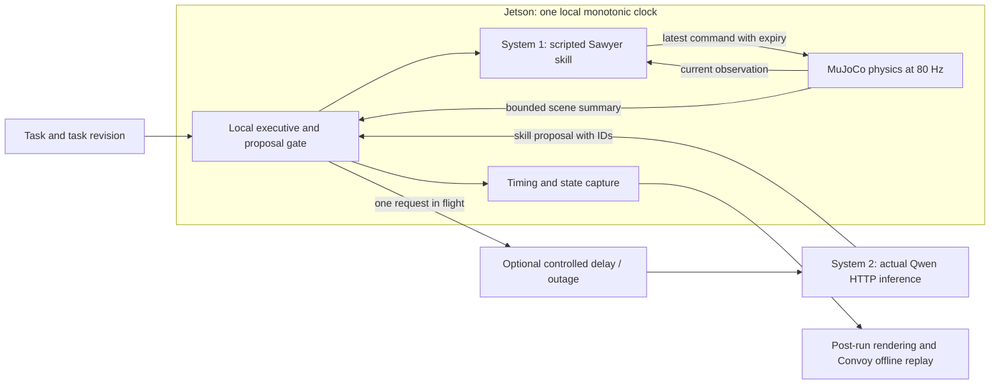

# System 1 / System 2 scheduling experiment

This first experiment asks whether a robot's local controller can keep working while a remote language model is thinking, and whether an old plan can be prevented from controlling a changed task. It is a bounded scheduling test, not a learned robot policy benchmark or qualification for a physical robot.

## What runs where



The measured hardware experiment runs physics and System 1 on the existing Jetson. Qwen2.5-1.5B-Instruct Q4_K_M runs in a separate temporary llama.cpp process on the Mac CPU, accessed over an SSH reverse tunnel on the LAN. This is real remote inference, with no AWS compute provisioned. It does not measure an AWS endpoint, WAN, or wireless handoff. Added delays, jitter, and outages are explicitly controlled faults.

The existing deployed planner/policy services are not reconfigured. The lab server and tunnel are temporary, bound to loopback and use a private token file. Their token and local SSH credentials are never included in evidence or source control.

## The task and the policy

The environment is seeded MetaWorld Sawyer `pick-place-v3` in MuJoCo. There are two named elevated target regions, A and B. At 2.5 seconds the requested target changes from A to B. The local executive fences the previous command immediately, then asks for a proposal for the new task revision.

System 2 receives a compact textual scene summary, task instruction, allowed skills/targets, request ID, observation sequence and task revision. It must return one strict JSON object containing those IDs and either `pick_place` with a named target or `hold` with no target. Truncated, malformed, mismatched, expired, duplicate, or stale replies are not repaired into valid decisions. There is no model-to-reference fallback.

System 1 is the upstream scripted `SawyerPickPlaceV3Policy`, using the privileged 39-dimensional simulator observation. It emits four normalized Cartesian-delta/gripper values. This is **not SmolVLA, a VLA trained for this robot, or joint torque control**. It isolates scheduling behavior from learned-policy errors. MuJoCo and MetaWorld's controller convert these bounded inputs into the simulated robot's movement.

Success means the puck remains within 7 cm of the final target for ten observed physics ticks after the task revision. This follows the upstream target-distance threshold, but does not require releasing the object or prove safe tabletop placement. Benchmark success and grasp status are also retained separately. The custom horizon and targets differ from an unchanged MetaWorld benchmark.

## The comparison

The same seeds, controller, physical scene and timing settings are used across three execution modes:

- **Local:** an explicitly deterministic local planner is the mechanical reference baseline.
- **Blocking remote:** control holds while a remote planner request is pending. Physics still advances.
- **Asynchronous remote:** an approved skill may keep running while a refresh is pending, until its local validity expires. A new task revision clears that authority immediately.

The standard matrix has two seeds, a local baseline, and both remote modes for three fault profiles: nominal, 500 ms extra delay with ±150 ms jitter, and 2.5 seconds extra delay with the second request unavailable. These are small experiments, not statistically powered performance claims. Failed and timed-out trials remain in the denominator.

Physics has an independent thread paced against monotonic wall time. Missed scheduler slots are counted and skipped; there is no unbounded burst of catch-up physics and no slowing the simulation to wait for inference. The local command has an expiry watchdog. The executive has separate bounds for proposal age, request admission, and goal validity, and there is at most one network call in flight. On task stop, publication is fenced immediately; the matrix drains any outstanding transport call after physics closes before starting another trial.

The default matrix uses a 12-second wall-time limit, a 0.5-second planner refresh interval, a 4-second request deadline, a 3.5-second maximum proposal age, a 4-second goal validity, and a 100 ms command expiry. These are experiment settings, not universal robotics timing requirements. Change them for the supported robot/controller and measure again.

## Running it

Use the optional simulator environment, not the control-plane service image. Existing simulation installation instructions apply. Run these commands on the host intended to represent edge compute:

```sh
python -m convoy_sim.hierarchy.cli --mode local --output ./local-run

python -m convoy_sim.hierarchy.matrix \
  --planner-url http://127.0.0.1:55130 --model convoy-qwen-lab \
  --token-file ./planner.key --output ./matrix-run \
  --edge-host 'Jetson Orin Nano' --planner-host 'Mac CPU over LAN' \
  --network-path 'SSH reverse tunnel over LAN'
```

Output directories must be new. Record the source revision and model checksum with `--source-revision` and `--model-sha256`. `matrix.json` records completion and each trial; `metadata.json`, `summary.json`, `steps.jsonl`, and `planner-events.jsonl` retain the complete evidence. The metadata records the runtime versions, source bundle checksum, placements, fault parameters, policy identity, and exact success criterion.

Rendering is disabled during measurement. Copy the evidence to a graphics-capable machine with the identical simulator package versions, then reconstruct observer images:

```sh
python -m convoy_sim.hierarchy.recording \
  --input ./matrix-run --output ./matrix-replay \
  --config-label 'Jetson timing lab · Qwen + reference skills'

python integrations/simulation/scripts/import_offline_eval.py \
  ./matrix-replay --dry-run
```

The existing importer reads credentials from the environment. Import a completed replay, then link its offline evaluations to a simulator robot under the project's saved configuration. The application shows outcomes, scalar timing summaries, actions, target/skill changes and System 2 state at every recorded tick. Images are downsampled; action and hierarchy traces are not. Replays are labelled imported/reported evidence, not signed timing qualification. Full distributions and events remain in the exported evidence sidecars.

## What to measure next

Report task outcome separately from planner latency, observation age, physics lag, held ticks, stale rejections and watchdog behavior. A successful task can still miss timing requirements. A slow planner can be tolerable if local control retains bounded authority, and an expired plan can fail safely while physics continues.

The next experiment should keep this executive and substitute a learned action-policy adapter with its own documented observation/action contract. Measure its real inference latency on the Jetson, then add bounded action chunks and test starvation and task changes inside a chunk. Isaac Sim can become another scene adapter once its hardware/runtime placement is supported; this first test is MuJoCo only. Neither arbitrary robot discovery, system identification nor wireless QoS is implemented by this scheduling experiment.
